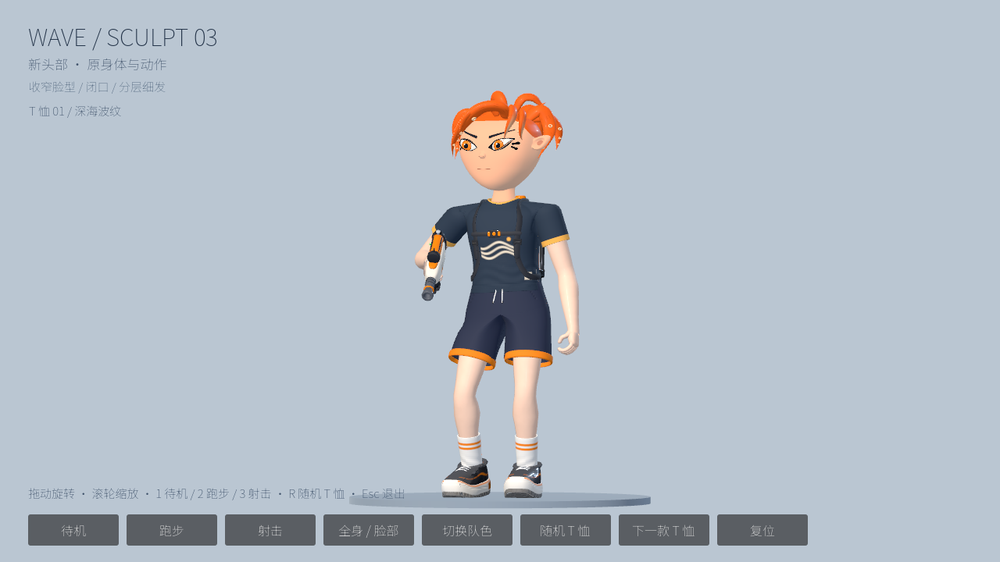
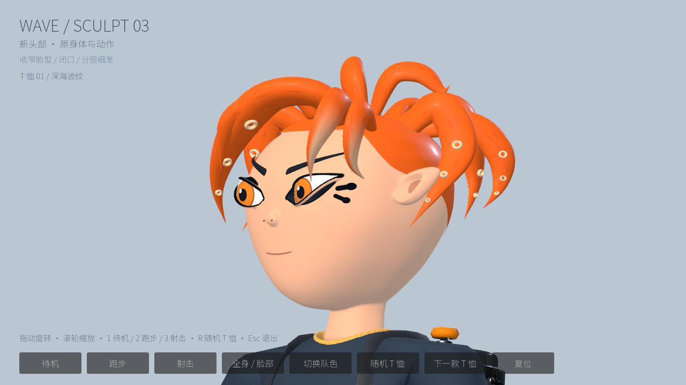
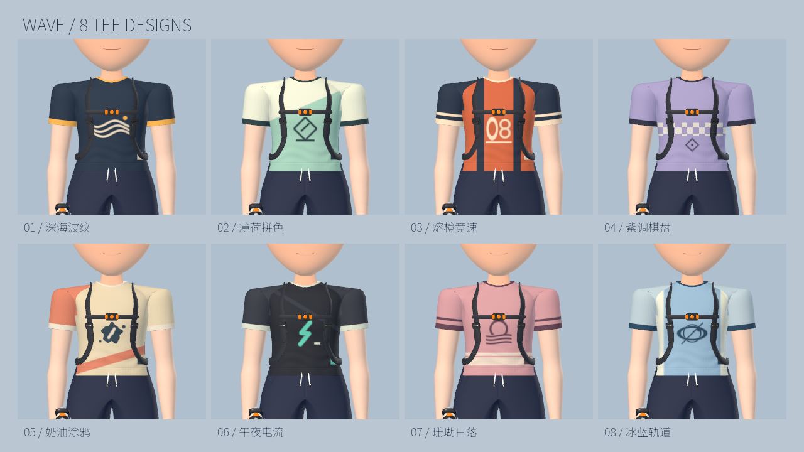

# WAVE 人物样板 · SCULPT 03

2026-10-01。按最新反馈收窄脸型、平顺下颌轮廓、改为自然闭口、增加细发束，并为原身体设计八款可随机切换的 T 恤。本目录是独立三维样板；尚未替换游戏默认人物。

## 打开与检查

双击 `预览精细人物.command`，在原生 Godot 窗口查看实际模型：拖动旋转、滚轮缩放、底部按钮切换全身／脸部和队色；`1/2/3` 切换待机／跑步／射击，`R` 随机 T 恤，`Esc` 退出。“下一款 T 恤”可逐款查看，“随机 T 恤”保证与当前款不同。换衣服保留身体动作、模型和脸部取景；换队色保留所选 T 恤。

Godot 命令：

```sh
/Applications/Godot.app/Contents/MacOS/Godot \
  --path godot-port-prototype \
  res://experiments/character-sculpt/studio.tscn
```

## 与被否决版本的制作差异

1. 在 Blender 5.2.0 LTS arm64 中，用单独设计的细分控制网格塑造额头、颧骨、下颌和下巴；鼻子、耳廓、颈部与眼眶边缘经过体素融合和表面平滑，形成连续皮肤。
2. 脸部最大半宽由 0.172 收至 0.13524（约 21%），下颌采用更密的横截面控制平顺曲线，眼睛与眉毛间距同步收窄。根据追加反馈，以下巴为基准将上方头部高度缩短 20%，宽度和厚度再缩小 8%，颈根与下巴高度保持。保留眼眶实际开孔、球面眼白、实体眉毛和耳廓内凹；去掉歪斜露齿开口，在连续皮肤上绘制短而对称的闭口唇线。
3. 头发由八束增至十四束，最大束宽由 0.056 降至 0.034；前额、两侧、头顶和后脑分层安排长短与曲率。吸盘同步缩小，减少大块高光。新头部有 31 根骨骼和轻微发梢摆动。
4. 按原身体的实际单位制作头部，移除旧头部和旧长颈，保留原 87 骨骼身体、衣服、鞋、武器和身体动作。独立适配器跟随原头部骨骼，不修改游戏默认人物脚本。

八款 T 恤：深海波纹、薄荷拼色、熔橙竞速、紫调棋盘、奶油涂鸦、午夜电流、珊瑚日落、冰蓝轨道。各款有独立底色、胸前图案、拼色、领口和袖口；保留原身体网格、布料细节、短裤和鞋。图案使用原绑定空间坐标，身体动作不会让印花在衣服上滑动。各人物使用独立材质，换衣不会影响其他人物。

头部样板约 76,740 三角形；尚未完成面向多人实战的减面、LOD 和性能验收。当前没有眨眼或表情形变，不应据此宣称脸部动画完成。

## 可编辑文件

- `source/sculpt-head.blend`：Blender 源文件，含最终融合网格、骨骼与隐藏的 `Editable sculpt cages` 集合。
- `build_sculpt.py`：可重复生成的建模脚本；源文件和导出 GLB 的校验值在 `manifest.json`。
- `sculpt-head.glb`：Godot 使用的模型。
- `avatar.gd`：原身体与新头部的独立适配器。
- `skin.gdshader`、`eyes.gdshader`、`hair.gdshader`：Godot 最终材质。
- `wardrobe.gd`、`tee_patterns.gdshaderinc`：八套配色和原创图案。
- `build_wardrobe.py`：在原衣物材质上生成 `cloth.gdshader`，只重画 T 恤、袖子和领口，保留其他衣物与布料细节。
- `gallery.tscn`：八款 T 恤的独立原生画廊。
- `预览八款T恤.command`：双击查看八款衣服近景，`Esc` 退出。

控制网格是保留的制作副本，并未与最终体素融合网格建立实时修改关系；可以编辑最终网格，也可以调整脚本重建。Blender 源文件只含头部，身体在 Godot 中复用现有资源；Blender 视口不会显示 Godot 专用瞳孔、眼线、闭口唇线等着色。

## 已验证的范围

- Godot 显式脚本重载检查；两种队色下，待机、跑步和射击各 90 帧，身体与新头部骨骼变换有效。
- 这些动作中，下巴与领口垂直距离约 0.0327–0.0365；颈根与领口定位点距离约 0.0069–0.0106，已检查完整肩颈关系。
- 保留原身体 5,636 个三角形；移除旧头颈 12,048 个三角形；脸部专用 UV 经 Blender 导出和 Godot 导入后保留。
- 原版人物回归检查通过：默认仍是原 Web 人物，原衣服属性、动作、地面高度和各变体发束锚点有效。
- Apple M5 / Metal / Forward+ 原生渲染截图覆盖全身、正脸、侧脸、背面、跑步、射击和两种队色。代码检查不能代替美术验收。
- 向原生视口发送鼠标和键盘输入后，动作按钮、脸部取景、队色切换、复位、拖动旋转、滚轮缩放、随机／下一款 T 恤及 `1/2/3/R` 快捷键均有响应；换衣保留模型和脸部取景。八款逐一渲染核验，并检查实际生效材质，防止旧整网格材质覆盖新衣服。

当前截图位于 `../render-evidence/sculpt-v3-*.png`，是 Godot 对实际模型的渲染。`sculpt-*.png` 中没有 `v3` 的图片保留上一版效果。






