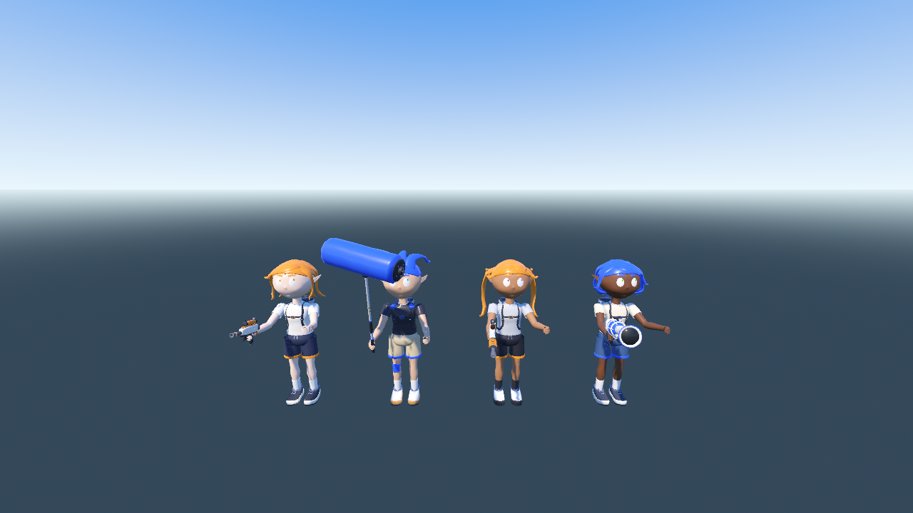
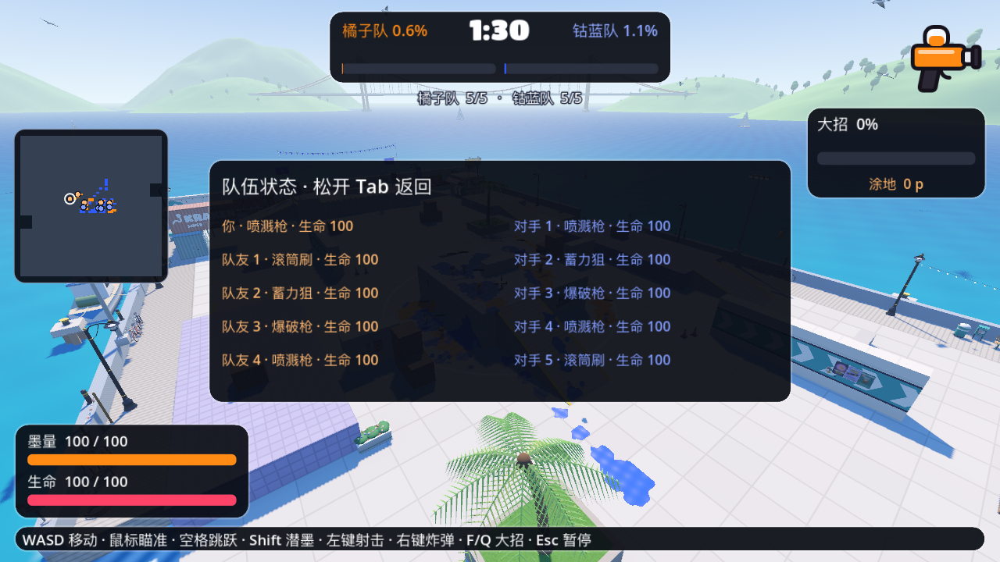

# INKWAVE Godot Demo

当前版本：**v0.3.0-preview.1 · Apple Silicon / arm64 单机预览版**。

默认是 **5v5**（你和四名队友机器人，对抗五名机器人），支持 Tidewater / Kelpline 两张原版地图；赛前可切回 1v1、选择 90/180 秒、玩家武器、对手先锋武器、四种角色外观、五组配色或色盲配色。




## 运行与操作

需要 Godot 4.8.dev6；仓库根目录执行：

```sh
./godot-port-prototype/run.sh
```

- 点击武器卡片，或按 1–4 选择武器；B 轮换对手先锋武器。队伍其他机器人使用混合武器配置。点击“开始对局”或 Enter 开始。
- WASD 移动，鼠标瞄准，空格跳跃，Shift 潜墨，左键主武器，右键按住/松开投弹，F/Q 大招。
- Tab 查看十人名单、武器、生命与重生状态；Esc 暂停，使用“继续对局”“设置”“返回赛前菜单”。
- 被击倒后释放鼠标，可点击卡片更换玩家武器；计时继续，重生后恢复鼠标捕获。存活时不能换武器。
- 结算后点击“再开一局”返回赛前选择，或点击“退出游戏”；Enter/R 也可重开。
- 设置保留上一发布版的 30/45/60 FPS、90/100/110% 界面缩放及鼠标灵敏度，保存到 `user://inkwave_settings.cfg`。默认 30 FPS；物理保持 30 Hz。地图、人数、发型、配色、时长与武器选择限当前会话。

Godot 编辑器打开 `project.godot` 后也可 F5 运行。`run.sh --compatibility` 为不含 SSAO 的备用渲染，`run.sh --flat` 保留历史平地样机。

## 实现与边界

- 角色使用原版 `character.js` / `character-geo.js` 等生成的四套几何、87 根骨骼、蒙皮权重及原版四武器。Godot 驱动基础步态、空中姿态、瞄准、后坐力、甩墨/投弹和发梢动作；原版 GLSL 材质以顶点颜色/队色掩码近似重建，未移植完整脚部 IK、表情、舞蹈与全部动作层。原始网格资源共享；同队角色共用显示材质。旧基础模型作为缺失资源时的后备，加载原版资源后隐藏。
- 两地图均使用原版结构与道具碰撞、暴露表面和被遮挡计分格。Tidewater：145 碰撞块、69,366 有效计分格；Kelpline：141 碰撞块、76,563 有效计分格。两者都有原版道具、壁画和港口远景；海水等使用 Godot 近似效果。
- 5v5 有每角色敌我关系、生命、死亡/保护重生、四武器命中、炸弹/冲击波/墨雨群体伤害及共用权威计分。友方不会挡住武器的敌人命中查询，也不会受友伤。队友涂墨不增加玩家自己的点数或大招。
- 多人机器人使用原版 NavGraph 导出数据和 AStar 路线，支持不同路线与机器人之间交战；独立 CharacterBody3D 移动体执行碰撞、支撑和下落，避免在出生台落差边缘停住。跳跃边未启用；仍未达到原版潜墨、撤退、难度、炸弹/大招决策和完整 WeaponRunner。
- HUD 包含小地图、双方存活人数、击倒提示、Tab 名单、生命/墨量/大招与结果；小地图约一米采样、每 0.25 秒更新，仅作显示。计分仍使用 0.25 米 CPU 归属格。
- 音频、联机、完整战斗/屏幕特效、入场镜头与结果角色展示尚未移植。

## 检查与构建

```sh
NODE=$(command -v node) CHECK_TIMEOUT=20 ./godot-port-prototype/tools/run_checks.sh
python3 godot-port-prototype/tools/test_parse_gate.py
python3 godot-port-prototype/tools/test_visual_config.py
./godot-port-prototype/export_macos.sh
```

唯一规则入口包含两地图的导出校验、角色/导航来源校验、解析预检与全部短测。原生 GUI 验收入口：

```sh
/Applications/Godot.app/Contents/MacOS/Godot --path godot-port-prototype --script res://tools/capture_release.gd
```

最终检查与原生短验收见 [RENDERING.md](RENDERING.md)。GUI 流程包含鼠标开始/再开/设置保存、下拉选择信号、110% 缩放、两地图十角色短运行及截图；对战位置和出生保护为截图条件，阶段等待缩短。不是完整 90/180 秒人工试玩，也没有长期温度或帧率结论。

`export_macos.sh` 只导出 arm64，验证签名、架构和短启动。应用是临时签名，未经 Apple 公证。源码快照和 ZIP 发布到专用仓库 `lmjshineee/inkwave-godot-demo`，原仓库上游不推送。许可证见 [THIRD_PARTY_NOTICES.md](THIRD_PARTY_NOTICES.md)。
