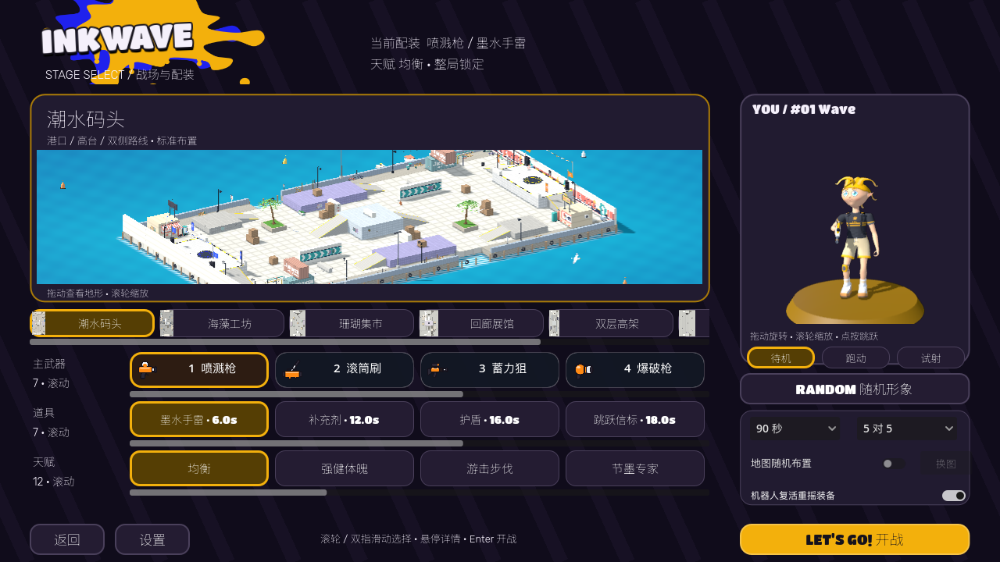
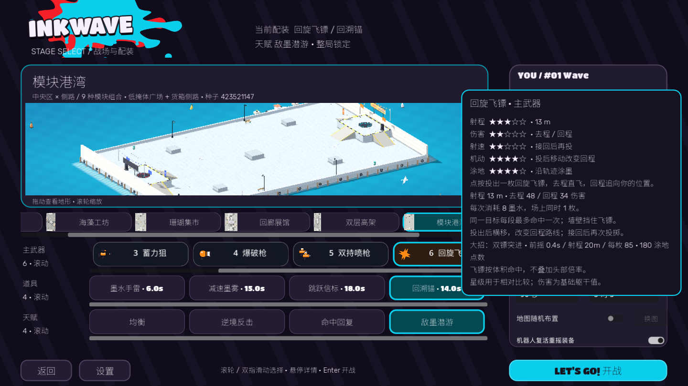

# INKWAVE Godot Demo

三弦墨弓已重做：轻点快速涂地，0.4秒半蓄布置爆裂箭，0.8秒满蓄三箭收束精准远射。耗墨3→7、蓄力移速4.6m/s，实际16／23m满蓄躯干命中108；同轮直击＋爆裂共享预算，增伤与易伤结算后仍最多115。准星显示三箭收束和半蓄刻度，简短提示与满蓄音效接入；机器人近身快射、低墨半蓄。106项完整回归、两种原生渲染及两图四局90秒模拟通过，真人平衡仍需试玩。[定位与验证](render-evidence/bow27-summary.md)。

推进伞已重做：贴地瞄准推出可沿平地／坡道走，推出后按住持续射击；低墨预留推进费用，避免开伞只耗墨却无法推出。六弹各15、每轮5墨、0.48秒间隔、220HP伞面，推出8墨／4.5秒CD。湿墨增加边缘隆起法线、缓慢起伏与清漆反光；原生地图补齐七种材质。珊瑚集市改成3.4m屋顶侧路＋交错摊位，双层高架改成6m悬桥＋桥下地面＋长侧坡；碰撞／涂墨／导航／小地图／布景同步。验证与范围见 [当前记录](render-evidence/canopy26-summary.md)。


当前源码：**实时双方涂地率、逆风支援、放大的结算地图、墨翼道具与四种行为天赋已实现**；最新公开应用仍为 **v0.3.0-preview.15 · Apple Silicon / arm64**。

新增回旋飞镖／双镖大招、回溯锚、敌墨潜游与双持滑步，另加入三弦墨弓、推进挡墨伞与脉冲声呐；弓配雨箭齐射、伞配吸墨反击，加入可拆除感应墨雷、回声诱饵与接力补给盒，信息墨雾替代减速墨雾，新增墨翼背包，以及翻墙加速／残墨引爆／极限省墨／涂地充能，当前可选配装为 8 武器／9 道具／8 天赋。用下方 `run.sh` 运行新增功能；已有 preview.15 应用不包含这批源码改动。具体操作与验证见 [CREATIVE_LOADOUTS.md](CREATIVE_LOADOUTS.md)。

本版结算左侧地图进一步放大，长图转为横向保留比例，无外框／黑色留白，双方最终涂地率置于地图下方；右侧战绩按队伍分列。对局采用紧凑悬浮 HUD：无框小地图在左上，旁边为缩小的真实双方涂地率与队色细条；两队各5个武器／编号／存活图标紧贴倒计时两侧，完整名字留在 Tab 名单。右侧大招、左下道具／天赋／血墨及底部按键提示统一缩小，低墨才显示准星旁墨条，最后十秒仅顶部倒计时变色。真实冷却、进度、低资源和逆风支援仍有反馈。[当前 HUD](render-evidence/hud24-prism_gallery-1280-100.png)、[小窗口末秒](render-evidence/hud24-viaduct-low-final.png)、[紧凑布局验证](render-evidence/hud24-summary.md)、[当前结算](render-evidence/creative22-results.png)。下方 `run.sh` 运行当前源码；Apple Silicon 应用见 [Release](https://github.com/lmjshineee/inkwave-godot-demo/releases/tag/v0.3.0-preview.15)。

应用打开进入主菜单 → 配装 → 对局，默认 5v5，也支持 1v1 和 90／180 秒。现有角色脸部保留，RANDOM 随机全身变体、装饰与队色，当前配装始终可见。全部机器人武器／道具／天赋默认随机；复活可重摇装备，**天赋整局固定**。

敌墨潜游修正：敌墨每秒6 HP、连续停留最多20 HP，敌袭+10%；修复易伤突破普通主射最终封顶导致狙击秒杀。103项回归与双渲染实际Shift验证通过；补齐8天赋／9道具的18场完整90秒、162个机器人单局样本，[修正与验证](render-evidence/swim25-summary.md)、[分组对照](render-evidence/swim25-perk-items-summary.md)。

能力图标与配装反馈已完成：9 个道具、8 个天赋、5 个大招均有独立 SVG，配装卡片、左下两行配装与右侧大招共用。实时显示道具冷却／使用中／缺墨／动作锁、回溯范围和天赋触发，[图标](render-evidence/creative23-icons.png)、[小窗口冷却](render-evidence/creative23-cooldown-small.png)、[本批验证](render-evidence/creative23-summary.md)。




## 运行与操作

Godot 4.8.dev6，仓库根目录执行：

```sh
./godot-port-prototype/run.sh
```

1. 八种主武器、九种 CD 道具与八种天赋在同一配装页以三个横向滚动带选择，支持滚轮／双指滑动／滚动条／键盘焦点；选择配装和地图／人数／时长，再点击开战或 Enter。地图大预览支持旋转／缩放；人物可拖动／滚轮／点击跳跃，待机／跑动／试射。武器、道具和天赋悬停显示详情；五星移到单列浮层，卡片取消分栏，显示更多真实数值。
2. 弓按住蓄力、松开发射三箭，地面横向／空中纵向，半蓄起落点延迟爆裂、满蓄三箭收束；伞点按散射、按住开伞，继续按住推出，敌弹能打碎伞面。详情见 [配装操作](CREATIVE_LOADOUTS.md)。
3. WASD 移动、鼠标瞄准、空格跳跃、Shift 己方墨面潜泳／墨墙攀爬、左键主武器、F / Q 大招。弓的大招先锁定可见地面、三轮抛射雨箭，屋顶挡箭；伞的大招正面吸弹最多 3 秒，收口 0.4 秒后自动反击，侧后方与狙击／手雷仍危险。双持按住左键 + 方向 + 空格滑步；敌墨潜游天赋允许 Shift 在敌墨地面潜泳。
4. 右键 / E 使用所选道具：手雷、信息墨雾、跳跃信标、回溯锚、脉冲声呐、感应墨雷、回声诱饵、接力补给盒或墨翼背包。墨翼是道具，40 墨水／CD 18 秒，飞行 4 秒；空格上升、Shift 下降，最高离起点 4.5m，可用当前主武器，每秒耗墨 8；不能回墨、潜泳、用其他道具或发动大招。声呐为 40 墨水／60 HP／8 秒／CD 18 秒，每 2 秒扩散 12 m，受墙与楼板遮挡，命中后全队标记 2 秒。回溯锚按一次标记、再次返回（25 墨水／12 秒／18 m，锚 40 HP；结束后 CD 14 秒）。信息墨雾 35 墨水／6 秒／CD 15 秒，己方可透视己雾，声呐可反制，子弹可穿雾。墨雷 30 墨水／25 HP／CD 10 秒，0.8 秒布防后感应接近，0.45 秒警告再爆炸并标记；敌弹可安全拆除，墙／楼板遮挡，每人最多两枚。诱饵骗取瞄准／弹药、声呐识破；补给盒提供两份最多 35 墨水，静止 0.6 秒领取，每角色每盒一次，敌方可抢。死亡和换装保留冷却。
5. 死亡立即显示复活地点与 4 秒倒计时（残墨引爆额外 .75 秒），点队友／信标一次排队，到零发射；Esc 取消回基地，J 再打开。基地仍支持鼠标 / WASD 瞄准，左键 / 空格 / Enter 出场；R 重摇武器与道具，天赋不变。目标失效安全回基地。
6. 存活按 J 选择队友／信标，点击后蓄势 1 秒、可被攻击／取消，公开落点预告；落地不回血、不补墨，冷却 4 秒。按实际楼层核验，信标要求己方墨地。
7. Tab 战术地图／名单：敌方需要队伍实际发现或声呐标记，失去接触后仅保留最后发现位置 1.5 秒；潜墨可隐藏，死亡清理标记。Esc 暂停；暂停和结算可返回主菜单。结算显示地图、双方比例和所有角色名字／编号／击倒／阵亡／有效伤害。

设置支持 30／45／60 FPS、75／100% 精度、90／100／110% UI、灵敏度与音量，保存在 `user://inkwave_settings.cfg`。默认 30 FPS / 75%；菜单关闭对局地图绘制，使用独立人物视口和按需更新的真实地图预览。编辑器打开 `project.godot` 可 F5；`run.sh --compatibility` 为备用渲染，`--flat` 保留历史平地样机。

## preview.14 / preview.15 历史基线

- **滚动配装**：武器、道具、天赋保留在同页，以三个独立裁切滚动带选择，浮动单列星级／数值保留；新武器为双持喷枪、长管喷枪、轻爆枪。
- **更多道具与天赋**：爆墨瓶、减速墨雾和医疗领域，共用 CD、阵营、遮挡及楼层规则；道具技师、命中回复、稳枪专注、循环墨泵仍赛前选、整局锁定。机器人可随机选用。
- **人物曲面细化**：沿用当前脸型、87 骨骼和肩袖／裆部修正，增加头、耳及解析曲面采样；完整导出模型约 5.9 万至 7.9 万三角，包含潜墨体与四个源武器。人物预览开启 4×MSAA，双持增加左手源喷枪模型。
- **七图十九布局**：新增模块港湾（3 种中央区 × 3 种镜像侧路，种子选择，换图保持配装）、阶梯花园（0／3／6 米平台与坡道）。所有布局同步碰撞、墨面、导航与小地图；当前为预导出的有限模块组合库。
- **基础规则保留**：120 HP、部位／距离／遮挡伤害、滚筒同轮预算、护盾后实际扣血、队色飘字；名字／编号、即时复活选点倒计时、队友／信标跳跃和原音乐／动作均继续使用。
- **测量**：182 组受控实际攻击、84 组容量配置，见 [BALANCE_REPORT.md](BALANCE_REPORT.md)。不会把受控命中时间当成人工平衡验收。

CPU 墨格为归属与计分权威，渲染和 UI 不参与计分。地图几何、道具碰撞、有效墨面、导航与小地图通过原网页适配器导出，额外布局由 `tools/lib/arena_layouts.mjs` 定义。机器人使用实际碰撞和源导航边，支持九人移动、八种可选武器、道具、大招、敌墨潜游及双持滑步；完整战术决策与难度仍为后续工作。

具体数值、来源、验证与下一批顺序见 [GAMEPLAY.md](GAMEPLAY.md)。人工手感、长期温度尚未验收；未知位置桥梁漏染待定位。逐骨骼命中盒、完整程序地图生成、机器人自动队友跳跃、可射击摧毁信标、坡面脚部 IK、音乐分层和联网尚未完成。

## 检查与构建

```sh
NODE=$(command -v node) CHECK_TIMEOUT=25 ./godot-port-prototype/tools/run_checks.sh
./godot-port-prototype/export_macos.sh
python3 godot-port-prototype/tools/package_macos.py --version v0.3.0-preview.14
```

当前 **102 项通过、0 失败**；墨翼、四种行为天赋、逆风支援和结算 UI 的规则、原生画面与对局证据见 [第七批记录](render-evidence/creative22-summary.md)。下列 81 项为 preview.14 历史结果，见 [全套检查](render-evidence/expand14-checks-final.txt)、[原生界面](render-evidence/expand14-ui-final.txt)、[两张新图 90 秒自然回放](render-evidence/expand14-full-matches.json)。[阶梯花园实际控制器通行](render-evidence/expand14-check_garden_platforms.txt)验证双方出生区到 6 米平台。人工手感与长期温度尚未验收。

地图重导出：`node godot-port-prototype/tools/export_arenas.mjs`。视觉烘焙依赖已有 Playwright / Chrome；`--check` 只读。角色动作、材料、音频、图标／菜单同样有来源和输出哈希检查；无任天堂商业资产。

最新编译输出在 `build/`：arm64 应用、preview.14 ZIP 和 SHA256 文件，签名为临时签名，未经 Apple 公证。[解压校验](render-evidence/expand14-archive-verification.json)检查 ZIP CRC、架构、签名和当前应用／PCK 哈希。上述 preview.14 文件为历史本地包；公开发布为 preview.15，当前新增源码未另行提交、导出或发布。许可证见 [THIRD_PARTY_NOTICES.md](THIRD_PARTY_NOTICES.md)，历史记录见 [RELEASE_NOTES.md](RELEASE_NOTES.md)。
