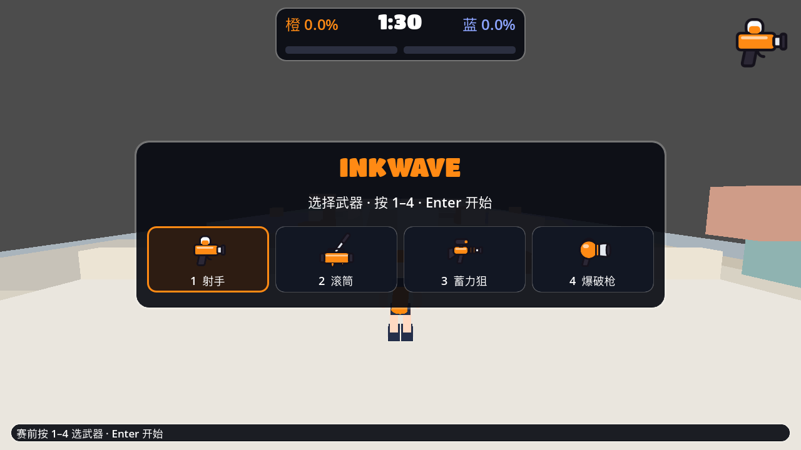

# INKWAVE Godot Demo（开发中）

**验证问题：** 现有网页游戏的涂墨、移动、潜墨和武器规则能否在 Godot 原生项目中组成一个可玩的最小闭环？这是可丢弃的样机，不是完整移植。

后续实现以 [Godot 特性选型与迁移规范](MIGRATION.md) 为准；其中区分了样机行为和网页游戏的正式规则。



## 运行

当前项目文件带有 `4.8` 特性标记；macOS 使用本机的 Godot 4.8.dev6 打开。在仓库根目录运行：

```bash
./godot-port-prototype/run.sh
```

默认启动 Tidewater 真实地图场景。首次运行或素材改变后，脚本会做一次无界面的素材导入；后续运行不会重复导入。也可用 Godot 编辑器打开 `godot-port-prototype/project.godot`，按 F5 运行。上图是 1280×720 的短时图形截图，确认了赛前菜单与地形的静态布局；没有持续试玩。旧版平地样机可单独启动：

```bash
./godot-port-prototype/run.sh --flat
```

这个场景有 Tidewater 地形碰撞、WASD/空格移动与跳跃、Shift 己方墨潜行加速及已涂墙面的攀爬、赛前及重生等待时的四武器选择卡片、左键使用武器、右键投掷墨水炸弹、涂墨充能与两种大招、双方覆盖率和 90 秒计时。按 Enter 后先经过 4.2 秒赛前介绍，时间到后依次进入终场、裁判和结果阶段。蓝队沿安全巡逻线进入中场、涂写计分地面，看到附近玩家会在确认路径可走后追击并近距离攻击；双方可受伤、被击倒并重生。玩家和蓝队已有阵营色人形、潜墨形态及四种可辨识的简化武器模型。完整弹道与特效、正式机器人行为仍待迁移。已做短时无界面规则检查，**尚未做图形试玩或温度测试**。

## 操作

- 赛前按 `1` 选射手、`2` 选滚筒、`3` 选蓄力狙、`4` 选爆破枪，`Enter` 进入开场介绍，随后开赛；被击倒等待重生时可重新选择。
- `WASD` 随相机方向移动；移动鼠标转身瞄准；左键使用武器（蓄力狙按住蓄力、松开发射）；右键按住、松开投出墨水炸弹（消耗 70 墨）；涂墨充满大招条后按 `F` 或 `Q` 发动冲击波（射手/滚筒）或墨雨（蓄力狙/爆破枪）；`Shift` 潜墨；`Esc` 暂停并释放鼠标，点击画面继续；`R` 重开。
- 90 秒对局结束后冻结操作，约 2.6 秒后统计地面墨迹面积，再展示约 5.1 秒裁判结果；覆盖率相同则随机决定胜方。HUD 顶部显示计时和双方覆盖率，左下显示墨量与生命，右上显示大招，终场有独立结果面板。
- 默认限制为 30 FPS、30 次物理更新/秒，以减少运行负载；这不能保证任何特定温度。若设备仍达到不舒适的温度，请停止运行。

### 导出 macOS 应用

[导出预设](export_presets.cfg)固定 Universal 架构和本地 Demo 的 Bundle ID。本机现已安装与 Godot 4.8.dev6 匹配的[官方导出模板](https://godotengine.org/download/archive/4.8-dev6/)；在仓库根目录运行 `./godot-port-prototype/export_macos.sh` 可生成 `godot-port-prototype/build/INKWAVE Demo.app`。2026-09-27 已实际导出：包内 arm64/x86_64 可执行文件、资源包和临时签名校验通过，导出的程序以 `--headless --quit-after 2` 启动没有脚本或场景错误；另用 `--quit-after 60` 确认导出程序能创建图形窗口并在约三秒后退出。脚本会重复执行导入、导出、日志、签名和无界面短启动检查。项目源场景已做数帧画面检查；导出的 `.app` 仍需检查真实输入、完整对局和设备温度。向他人分发另需处理正式签名与公证。

## 从原项目迁移了什么

- [原始参数](../public/game/src/config.js)：奔跑 6.0、干地潜墨 2.9、己方墨中 11.8、敌方墨中 1.9、潜墨回墨 42/秒；四类主武器的关键伤害、射程、墨耗与射速参数，以及 90 秒对局。
- [原始墨迹轮廓函数](../public/game/src/world/paint.js)的 `blobWobble`；CPU 格记录归属与面积，动态纹理显示相同归属。
- 一名玩家、一个简化敌方机器人，以及赛前和重生时换武器的交互。

### Tidewater 地图数据与碰撞（独立场景）

- `tools/export_tidewater_map.mjs` 从网页 `maps.js` 和 `Level` 导出 63 个结构块及其准确变换；`tools/export_tidewater_surfaces.mjs` 导出 289 个可见面，保留地面/墙面、可涂与计分标记。运行两个脚本的 `--check` 可检查生成数据与网页源码是否一致。
- [tidewater_map.tscn](tidewater_map.tscn) 无界面加载时生成 63 个碰撞体、10 个坡道和两个出生点；可通过碰撞体的来源 ID、命中点和法线定位原地图表面。Godot 4.8.dev6 的短时无界面检查通过，检查脚本见 [tools/check_tidewater_scene.gd](tools/check_tidewater_scene.gd)。
- 独立 [步行场](tidewater_walk.tscn)使用 `CharacterBody3D`，短测已检查落在出生平台、横穿平台并沿原地图坡道下降。[角色控制器](tidewater_walker.gd)按原 `actor.js` 参数实现水平起步、刹车、反向和转向，以及潜墨/敌墨速度变化；无界面行为检查见 [check_tidewater_handling.gd](tools/check_tidewater_handling.gd)。[跳跃检查](tools/check_tidewater_jump.gd)覆盖提前按键缓存、离地宽限、己方/敌方墨跳跃、顶点/下落重力和真实场景中的空格起跳。[形态检查](tools/check_tidewater_form.gd)覆盖低矮碰撞体、顶棚下禁止站起及空间清空后恢复站立。墙面短测还检查了干墙与敌方墨墙无法附着、己方墨墙爬升、松开潜墨脱离及顶边弹出。潜墨碰撞体目前用 12 边凸棱柱近似原作圆形体积；台阶/落地细节与实际移动手感仍未验收。
- [多表面归属格](surface_ink.gd)加载了 285 个可涂面、其中 61 个计分面与 70,180 个有效计分格。短测已检查涂地、重复涂、敌方覆盖、墙面涂墨不改变计分，以及 0–1 覆盖率接口；真实地图墨迹已有显示层，数帧近景确认地面涂墨可见，涂墨动画和整局显示效果仍未验收。
- [tidewater_play.tscn](tidewater_play.tscn)把地图碰撞、角色采样、[多表面墨迹显示](surface_ink_view.gd)和同一份 CPU 计分状态连成独立实验场。墨迹网格与纹理在首次涂到相应表面时才创建；无界面短测检查了空场景零墨迹资源、重涂不重复创建、角色读取己方墨以及敌方覆盖后的纹理更新。[生命规则检查](tools/check_tidewater_vitals.gd)覆盖敌墨伤害上限、离墨后回血、己方墨潜行加速回血及出生保护。显示仍是 0.25 米格子，未实现网页的流动边缘、墨迹扩张或甩墨拉伸；临时蓝队机器人尚未使用相同生命规则。
- `tools/export_weapon_config.mjs` 从网页 [config.js](../public/game/src/config.js) 导出四武器、墨水炸弹、两种大招、水平移动/攀爬、生命、重生和补墨参数到 `assets/weapons.json`；[tidewater_combat.gd](tidewater_combat.gd)读取这些参数并实现四武器、炸弹与大招的核心事件。涂墨面积充能，冲击波跃起落地涂墨并伤害，墨雨投出后持续漂移、涂墨并伤害；死亡后充能减半。[大招短测](tools/check_tidewater_special.gd)覆盖参数、充能、装甲、落地、弹体变云、持续效果与消失。大招表现仍是简化球体/冲击墨迹，没有原网页完整动画和粒子。
- [蓝队样机](tidewater_bot.gd)把移动、地面涂墨和近距离攻击从对局控制器拆出；攻击有短暂蓝色轨迹，头顶血条显示受伤情况。无界面检查确认其从出生区进入中场、路线避开静态碰撞、蓝队计分面积增加且终场停止。[追击短测](tools/check_tidewater_bot_chase.gd)还检查可见玩家吸引蓝队、安全身体位置，以及玩家重生时沿追击路径退回巡逻。[整局时间模拟](tools/check_tidewater_full_round.gd)检查暂停、90 秒蓝队涂墨、裁判和结果页；它不验证画面、玩家操作或实际运行 90 秒。蓝队仍缺少原网页的动态寻路、武器状态与回墨。默认场景现为 Tidewater；旧 `main.tscn` 保留为平地样机。已检查部分静态画面，完整图形对局尚未验收。
- [简化角色外观](tidewater_character_visual.gd)为玩家和蓝队生成人形、潜墨体及四种武器的低面数模型；仅从控制器读取阵营、形态和选中武器，不参与碰撞或伤害判定。[外观短测](tools/check_tidewater_visual.gd)核对蓝队颜色、武器显隐、形态切换、蓝队朝向及战斗反馈。数帧截图确认了玩家和蓝队的静态外形；它还不是网页的程序化角色模型、骨骼动作或武器动画，动作与手感尚未验收。

## 界面素材

- 从 [原项目的 SVG 图标代码](../public/game/src/ui/ui-icons.js)导出四个武器图标到 `assets/ui/`，可用 `node godot-port-prototype/tools/export_ui_icons.mjs` 重新生成。
- 复制了原项目的 Titan One 与 Rubik WOFF2 字体到 `assets/fonts/`，分别用于英文标题和数字；中文标签继续使用 Godot 默认字体。旧平地样机使用深色面板、橙色选中边框、武器卡片、图标和墨量条，对照了原项目的 [UI 样式](../public/game/styles/ui.css)。默认 Tidewater 场景已接入赛前/重生四武器图标卡片、选中边框、计时/覆盖率/墨量/生命/大招进度条、结果面板和中央准星；[HUD 短测](tools/check_tidewater_hud.gd)核对数值来源、阶段显隐与文字宽度。数帧截图修复了赛前图标溢出与底部提示可读性；原网页的液体仪表、动态角色徽章和入场动画尚未迁，动态界面仍未验收。
- 原项目只有两张地图光照贴图；它们依赖原地图几何的 UV，不适合直接贴到这个简化平地样机。其余多数场景纹理、HUD 装饰和动画由 JavaScript、SVG、Canvas、CSS 运行时生成，需要逐项重新实现。

## 边界

旧平地样机的墨迹仅覆盖地面；四种武器只保留核心行为。默认真实地图场景已有墙面/坡道墨迹格、显示层、相机转向和准星、己方墙面基础攀爬、低矮潜墨碰撞体、玩家敌墨伤害与回血、四武器/炸弹/两类大招的核心事件和简化伤害/重生循环，但缺少完整命中判定、甩墨形变、台阶/落地细节、完整角色动画与大招特效、完整机器人策略、网络联机及完整 UI 动效。温度目标必须在同一台 Mac 上以相同窗口大小和帧率实测，不能由引擎名称推断。

旧平地样机在 Godot 4.6.2 中完成过素材导入、三帧无界面启动检查和[两帧图形截图](preview.png)。默认 Tidewater 场景现在以 Godot 4.8.dev6 完成了赛前、开局及蓝队近景的数帧截图，并修复了截图发现的武器图标溢出和底部提示可读性问题。完整图形试玩、长期性能和设备温度尚未测试。
