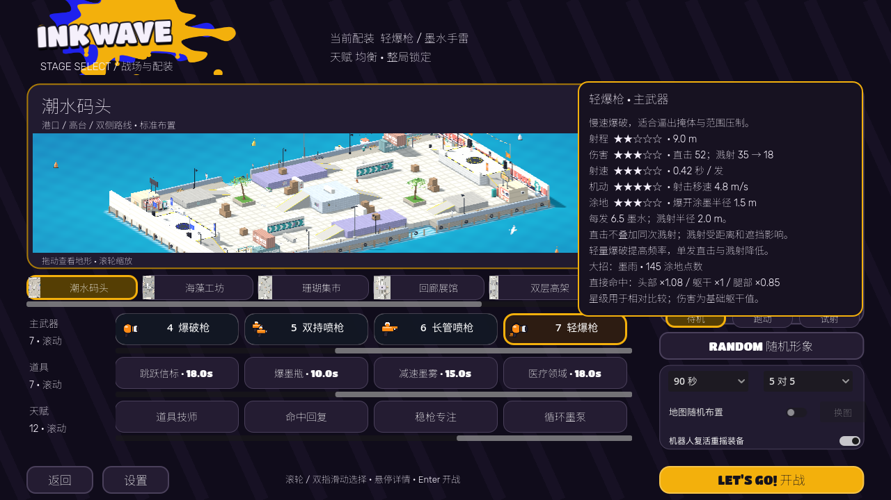

# INKWAVE Godot Demo

当前版本：**v0.3.0-preview.15 · 放大结算地图、分队战绩与七武器对照 · Apple Silicon / arm64 单机预览版**。

本版结算地图放大且无外框／黑色留白，战绩按队伍分列并显示个人涂地；远程机器人按武器射程交战。[新版结算](render-evidence/turf-results-1280x720.png)、[八局对照](render-evidence/match-loadouts-summary.md)。下方 `run.sh` 运行当前源码；Apple Silicon 应用见 [Release](https://github.com/lmjshineee/inkwave-godot-demo/releases/tag/v0.3.0-preview.15)。

应用打开进入主菜单 → 配装 → 对局，默认 5v5，也支持 1v1 和 90／180 秒。现有角色脸部保留，RANDOM 随机全身变体、装饰与队色，当前配装始终可见。全部机器人武器／道具／天赋默认随机；复活可重摇装备，**天赋整局固定**。




## 运行与操作

Godot 4.8.dev6，仓库根目录执行：

```sh
./godot-port-prototype/run.sh
```

1. 七种主武器、七种 CD 道具与十二种天赋在同一配装页以三个横向滚动带选择，支持滚轮／双指滑动／滚动条／键盘焦点；选择配装和地图／人数／时长，再点击开战或 Enter。地图大预览支持旋转／缩放；人物可拖动／滚轮／点击跳跃，待机／跑动／试射。武器、道具和天赋悬停显示详情；五星移到单列浮层，卡片取消分栏，显示更多真实数值。
2. WASD 移动、鼠标瞄准、空格跳跃、Shift 己方墨面潜泳／墨墙攀爬、左键主武器、F / Q 大招。
3. 右键 / E 使用赛前所选道具：手雷 CD 6 秒（右键按住瞄准、松开投掷，70 墨水），补充剂 CD 12 秒，护盾 CD 16 秒，跳跃信标 CD 18 秒／35 墨水／45 秒／两次跳跃；新增爆墨瓶、减速墨雾与医疗领域，CD 10／15／18 秒。没有地图拾取库存，死亡／重摇保留每种道具 CD。
4. 死亡立即显示复活地点与 4 秒倒计时，点队友／信标一次排队，到零发射；Esc 取消回基地，J 再打开。基地仍支持鼠标 / WASD 瞄准，左键 / 空格 / Enter 出场；R 重摇武器与道具，天赋不变。目标失效安全回基地。
5. 存活按 J 选择队友／信标，点击后蓄势 1 秒、可被攻击／取消，公开落点预告；落地不回血、不补墨，冷却 4 秒。按实际楼层核验，信标要求己方墨地。
6. Tab 战术地图／名单，Esc 暂停；暂停和结算可返回主菜单。结算显示地图、双方比例和所有角色名字／编号／击倒／阵亡／有效伤害。

设置支持 30／45／60 FPS、75／100% 精度、90／100／110% UI、灵敏度与音量，保存在 `user://inkwave_settings.cfg`。默认 30 FPS / 75%；菜单关闭对局地图绘制，使用独立人物视口和按需更新的真实地图预览。编辑器打开 `project.godot` 可 F5；`run.sh --compatibility` 为备用渲染，`--flat` 保留历史平地样机。

## 本批实现

- **滚动配装**：武器、道具、天赋保留在同页，以三个独立裁切滚动带选择，浮动单列星级／数值保留；新武器为双持喷枪、长管喷枪、轻爆枪。
- **更多道具与天赋**：爆墨瓶、减速墨雾和医疗领域，共用 CD、阵营、遮挡及楼层规则；道具技师、命中回复、稳枪专注、循环墨泵仍赛前选、整局锁定。机器人可随机选用。
- **人物曲面细化**：沿用当前脸型、87 骨骼和肩袖／裆部修正，增加头、耳及解析曲面采样；完整导出模型约 5.9 万至 7.9 万三角，包含潜墨体与四个源武器。人物预览开启 4×MSAA，双持增加左手源喷枪模型。
- **七图十九布局**：新增模块港湾（3 种中央区 × 3 种镜像侧路，种子选择，换图保持配装）、阶梯花园（0／3／6 米平台与坡道）。所有布局同步碰撞、墨面、导航与小地图；当前为预导出的有限模块组合库。
- **基础规则保留**：120 HP、部位／距离／遮挡伤害、滚筒同轮预算、护盾后实际扣血、队色飘字；名字／编号、即时复活选点倒计时、队友／信标跳跃和原音乐／动作均继续使用。
- **测量**：182 组受控实际攻击、84 组容量配置，见 [BALANCE_REPORT.md](BALANCE_REPORT.md)。不会把受控命中时间当成人工平衡验收。

CPU 墨格为归属与计分权威，渲染和 UI 不参与计分。地图几何、道具碰撞、有效墨面、导航与小地图通过原网页适配器导出，额外布局由 `tools/lib/arena_layouts.mjs` 定义。机器人使用实际碰撞和源导航边，支持九人移动、七武器、道具、大招及基本躲雨，仍有完整战术决策／潜泳／难度等后续工作。

具体数值、来源、验证与下一批顺序见 [GAMEPLAY.md](GAMEPLAY.md)。人工手感、长期温度尚未验收；未知位置桥梁漏染待定位。逐骨骼命中盒、完整程序地图生成、机器人自动跳跃、可射击摧毁信标、坡面脚部 IK、音乐分层和联网尚未完成。

## 检查与构建

```sh
NODE=$(command -v node) CHECK_TIMEOUT=25 ./godot-port-prototype/tools/run_checks.sh
./godot-port-prototype/export_macos.sh
python3 godot-port-prototype/tools/package_macos.py --version v0.3.0-preview.14
```

本轮 **81 项通过、0 失败**，结果见 [全套检查](render-evidence/expand14-checks-final.txt)、[原生界面](render-evidence/expand14-ui-final.txt)、[两张新图 90 秒自然回放](render-evidence/expand14-full-matches.json)。[阶梯花园实际控制器通行](render-evidence/expand14-check_garden_platforms.txt)验证双方出生区到 6 米平台。人工手感与长期温度尚未验收。

地图重导出：`node godot-port-prototype/tools/export_arenas.mjs`。视觉烘焙依赖已有 Playwright / Chrome；`--check` 只读。角色动作、材料、音频、图标／菜单同样有来源和输出哈希检查；无任天堂商业资产。

最新编译输出在 `build/`：arm64 应用、preview.14 ZIP 和 SHA256 文件，签名为临时签名，未经 Apple 公证。[解压校验](render-evidence/expand14-archive-verification.json)检查 ZIP CRC、架构、签名和当前应用／PCK 哈希。按用户要求仅保留本地包，没有公开 Release、源码推送。许可证见 [THIRD_PARTY_NOTICES.md](THIRD_PARTY_NOTICES.md)，历史记录见 [RELEASE_NOTES.md](RELEASE_NOTES.md)。
