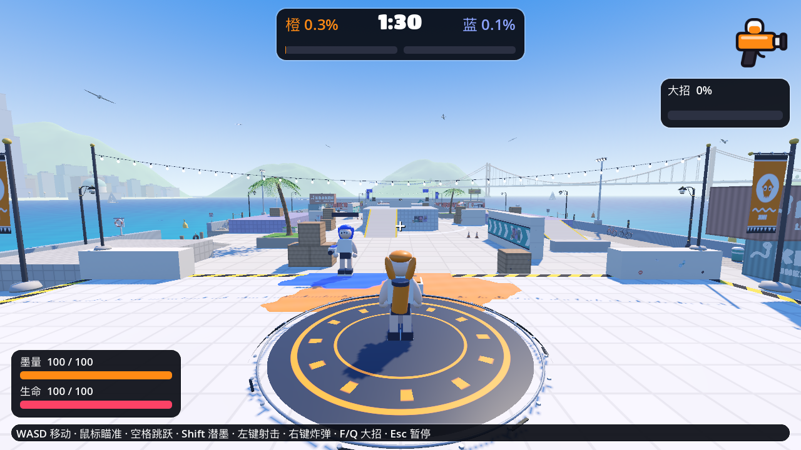

# 渲染实现与验证 · 2026-09-30

推进伞已重做：贴地瞄准推出可沿平地／坡道走，推出后按住持续射击；低墨预留推进费用，避免开伞只耗墨却无法推出。六弹各15、每轮5墨、0.48秒间隔、220HP伞面，推出8墨／4.5秒CD。湿墨增加边缘隆起法线、缓慢起伏与清漆反光；原生地图补齐七种材质。珊瑚集市改成3.4m屋顶侧路＋交错摊位，双层高架改成6m悬桥＋桥下地面＋长侧坡；碰撞／涂墨／导航／小地图／布景同步。验证与范围见 [当前记录](../../render-evidence/canopy26-summary.md)。


## 滚动配装、角色曲面细化与模块地图 · v0.3.0-preview.14 · 2026-10-01

1. 七武器、七道具、十二天赋在同页三个独立横向选择带：滚轮／双指滑动／滚动条／键盘焦点，保留单列浮动星级和真实详情；当前配装及当前地图自动滚入视区。新增双持喷枪、长管喷枪、轻爆枪，沿用源喷枪／爆破枪模型与动作族，双持补上左手模型。
2. 爆墨瓶、减速墨雾与医疗领域共用赛前选择、墨量、CD、阵营、楼层和遮挡规则，机器人可用。新增道具技师、命中回复、稳枪专注、循环墨泵；整局锁定、死亡和装备重摇不能清空 CD。
3. 原脸型、87 骨骼、肩袖／裆部修正、衣服和装饰保留，导出头／耳／圆角解析曲面提高采样，完整模型约 5.9 万 → 7.9 万三角（含潜墨与四个源武器）。独立人物视口 4×MSAA；新中文名称使用随包 OFL Noto Sans SC，避免缺字。
4. 七图十九套布局，新增模块港湾与阶梯花园。港湾按 3 种中央区 × 3 种镜像侧路组合，种子保持，“换图”保证换到另一组合；花园有 0／3／6 米平台与双侧连接坡道。碰撞、墨面、导航和小地图一起预导出，是有限模块组合库；任意运行时拼接另列 MAP-02。
5. 182 组生产攻击、84 组墨量配置见 [BALANCE_REPORT.md](../../BALANCE_REPORT.md)。新三武器一轮对基础满血躯干目标留下 87／77／68 HP；保留普通伤害上限、部位和距离规则。

证据：[81 项回归](../../render-evidence/expand14-checks-final.txt)、[原生滚动／换图／小窗口](../../render-evidence/expand14-ui-final.txt)、[双方实际控制器 6 m 通行](../../render-evidence/expand14-check_garden_platforms.txt)、[两张新图各 90 秒自然回放](../../render-evidence/expand14-full-matches.json)、[本地导出](../../render-evidence/expand14-export.txt)、[导出 PCK](../../render-evidence/expand14-pck.txt)、[解压／签名／哈希](../../render-evidence/expand14-archive-verification.json)。人工手感、长期温度与多局配装平衡未验收。

后续按顺序：多局收益对照 → 双持独立持握／坡面脚部 IK → 侦察道具与正式图标／特效 → 更丰富模块和运行时断路回退 → 音乐分层／机器人自动跳跃。仅本地 arm64 包，不上传。

## 同页配装、队友／信标跳跃与受控配装测量 · v0.3.0-preview.13 · 2026-10-01

当前玩法与剩余工作以 [GAMEPLAY.md](../GAMEPLAY.md) 为准，以下 preview.12 及更早章节保留历史。

1. 四武器、四道具、八天赋同时显示在同一个配装页，直接选择、无需切换标签。保留地图主体、独立可动全身预览与单列浮动星级／真实详情，960×540 / 110% 已核验。
2. 死亡立即显示地点与 4 秒倒计时，点存活队友／己方信标一次排队，到零自动发射；Esc 取消，保留基地快速出场。存活按 J 选目标，1 秒可受伤／可取消蓄势，落地不回血、不补墨；落点公开，起飞／到达重新核验占位和实际楼层，信标要求己方墨地，失效回退。
3. 第四道具跳跃信标：CD 18 秒、消耗 35 墨水、45 秒／两次使用，每人一个、重放替换。死亡／换装保留 CD 和已放信标；敌墨／占位暂不可用。机器人可放置，自动跳跃与可被射击摧毁尚未接入。
4. [BALANCE_REPORT.md](../../BALANCE_REPORT.md) 记录 72 组实际攻击与 32 组墨量配置。本批不改既有伤害数值；滚筒回归扩大至整轮墨滴生命周期。正式多局生存／涂地收益与人工手感仍待完成。

证据：**79 项通过、0 失败**，[全套检查](../../render-evidence/unified13-checks-final.txt)、[原生同页配装／小窗口／跳跃](../../render-evidence/unified13-ui-final.txt)、[回廊 90 秒自然回放](../../render-evidence/unified13-full-matches.json)、[本地导出](../../render-evidence/unified13-export.txt)、[导出 PCK](../../render-evidence/unified13-pck.txt)、[ZIP 解压／签名／哈希](../../render-evidence/unified13-archive-verification.json)。受控输入证明 6 m 落地，自然回放最高 8.89 m 含跳跃弧线；平均 29.84 FPS、P99 39.28 ms 含后台负载，非独占性能测量。人工手感／长期温度未验收。

后续：BAL-03 多局收益对照 → ITEM-02 进攻／侦察道具和资产 → ANIM-01／AUD-01；机器人自动跳跃继续列 DEPLOY-02 延伸项。只交付本地 arm64 包，不上传。

## 地图主体、可动 3D 人物与浮动星级 · v0.3.0-preview.12 · 2026-10-01

当前玩法见 [GAMEPLAY.md](../GAMEPLAY.md)，以下 preview.11 及更早内容仅用于追溯。

1. 地图选择为赛前主体：大幅实际地形 3D 预览、五张地图卡片，拖动／滚轮查看；切图保留武器／道具／天赋。静态地图按需刷新，窗口变更后重绘；入场关闭预览。
2. 人物独立 3D 舞台：旋转、缩放、点击跳跃，待机／跑动／试射，聚焦后 WASD 移动、空格跳跃；沿用实战原角色与动作，RANDOM 和队色保留。
3. 武器卡片取消左右分栏，五项星级放入单列悬浮详情，显示当前伤害、射程、射速、移速、涂墨、耗墨与大招；道具／天赋也有浮动说明，消耗计入节墨天赋。
4. 命中实际扣血数字弹起、上浮、淡出，颜色跟随攻击方队色；护盾和溢出已计入，快速连击合并，最多 24 标签复用、不透墙。

验证：**78 项通过、0 失败**，[全套回归](../../render-evidence/menu12-checks.txt)、[原生鼠标／键盘与 960×540 / 110%](../../render-evidence/menu12-ui-final.txt)、[导出](../../render-evidence/menu12-export.txt)、[PCK](../../render-evidence/menu12-pck.txt)、[ZIP 解压／签名／哈希](../../render-evidence/menu12-archive-verification.json)。原生 UI 与伤害为受控核验，旧版五图自然回放保留为玩法基线；人工手感和长期温度仍未验收。

下一批顺序保留：BAL-03 配装／高层地图对照 → DEPLOY-02 队友跳跃／信标 → ITEM-02 更多赛前道具 → ANIM-01／AUD-01。仅本地 arm64 包，不上传。

## 五地图、三层平台与锁定天赋 · v0.3.0-preview.11 · 2026-10-01

当前玩法见 [GAMEPLAY.md](../GAMEPLAY.md)，下面旧版内容仅用于追溯。

1. 新增珊瑚集市、回廊展馆、双层高架。回廊为地面／3 米／6 米三层站立平台与坡道；原两图可开启标准／木箱／矮墙随机布置。九套布局同步导出碰撞、有效墨面、导航与网页风格小地图。
2. 修复滚筒多滴叠伤，普通主武器不再一发击倒基础满血。喷枪 30、滚筒接触 60／近端甩墨预算 72、满蓄狙 100、爆破直击 82、手雷爆心 100；直接命中按头／躯干／腿 ×1.08／1／0.85，并保留距离、蓄力与爆炸遮挡规则。护盾后实际扣血和近期来源可见。
3. 八种赛前天赋，玩家自选、机器人随机，开战即锁定。死亡、复活和装备重摇均不改变天赋；150 HP／125 墨量等上限贯穿血条、治疗、阈值与重生。
4. 移植网页版双墨色 Logo、倾斜大导航、原图标与配装卡片；全身预览保留，四武器显示五项星级；随机重摇后和死亡界面明确显示当前配装。小窗口按钮与字号已调整。

证据：**76 项通过、0 失败**，[全套回归](../../render-evidence/balance11-checks.txt)、[三层实际控制器通行](../../render-evidence/balance11-gallery-platforms.txt)、[原生 UI](../../render-evidence/balance11-ui.txt)、[五图自然计时回放](../../render-evidence/balance11-full-matches.json)、[本地 arm64 导出](../../render-evidence/balance11-export.txt)、[PCK](../../render-evidence/balance11-pck.txt)、[ZIP 解压／签名／哈希](../../render-evidence/balance11-archive-verification.json)。界面测试包含受控伤害／阶段；自然对局不强制伤害与结束。人工手感和长期温度仍未验收，未知位置桥梁漏染待定位。

下一批：BAL-03 配装与高层地图对照 → DEPLOY-02 存活队友跳跃／信标 → ITEM-02 更多副武器 → ANIM-01／AUD-01。安全变体已完成本批范围，任意地形生成与联网仍列后续。仅本地包，不上传。

## 主菜单、随机配装与基地发射 · v0.3.0-preview.10 · 2026-10-01

preview.9 的地图点选再确认复活、拾取补给库存方案已撤回。当前以 [GAMEPLAY.md](../GAMEPLAY.md) 为准。

1. 应用先进入主菜单，再配装／开战；移植网页导航、字体、墨色和四武器图标。全身预览与实战相同，RANDOM 生成外观／装饰／队色，无外观下拉。菜单关闭主地图 3D 绘制。
2. 死亡立即进入基地发射视角，同时显示 4 秒倒计时，可边等边选，鼠标／WASD 瞄准，左键／空格／Enter 一次出场；空格可提前准备，死亡 R 重摇自己的配装。
3. 赛前选一个道具，右键／E 使用，手雷／补充剂／护盾 CD 6／12／16 秒，无地图拾取库存。全部机器人默认随机武器和道具，默认复活重摇，可关闭；各道具 CD 跨死亡／重摇保留，手雷保存攻击者与阵营。
4. 全部角色名字从网页池随机无重复分配，头顶／HUD／名单／击倒／结算统一，重生固定；机器人涂地充大招，有重击预告／墨雨与基本躲雨。保留稳定编号、血条、击倒来源、源地图小地图、120 HP 与大招强化；修复随机慢速滚筒在 1v1 平台边缘的体积穿模。CPU 墨迹计分与源资产导出不变。

证据：[69 项回归通过](../../render-evidence/frontend10-checks.txt)、[原生鼠标菜单／RANDOM／发射／道具／小窗口](../../render-evidence/frontend10-ui.txt)、[最终两图 180 秒自然对局](../../render-evidence/frontend10-full-matches180.json)、[本地打包](../../render-evidence/frontend10-build.json)。原生 UI 为受控条件，完整对局自然推进；人工手感与温度仍未验收。基础大招与躲雨已完成；后续平衡对照 → MAP-01 → DEPLOY-02 → ITEM-02，详见 GAMEPLAY.md。

以下为历史记录，旧复活／补给操作已失效。

## 手动复活、道具与战斗平衡 · v0.3.0-preview.9 · 2026-10-01

1. 死亡后由玩家点击己方墨地、确认落点，或明确选择回基地；4 秒倒计时结束后等待确认。落点被覆盖时要求重选，不随机替玩家部署。赛前可选基地左／中／右入口。
2. Shift 墨墙攀爬加快并补齐横向靠墙；右键炸弹保留，E 补充剂恢复墨水／生命、C 个人护盾有库存、冷却和吸收上限；机器人共用规则，每局成对随机补给布局。
3. 全员 120 HP，喷溅枪近端四发击倒、末端伤害衰减；大招回满墨水，重击范围／冲击反馈与 8 秒可见墨雨强化。网页导出参数保留，本地调整集中在 `gameplay_rules.gd`。
4. 最终结算显示地图、双方比例与全部角色编号／武器／击倒／阵亡／有效伤害，保留结果舞蹈。具体参数、Splatoon 3 参考范围与后续任务见 [GAMEPLAY.md](../GAMEPLAY.md)。

验证：[68 项检查、0 失败](../../render-evidence/gameplay9-checks.txt)、[双地图玩法短测](../../render-evidence/gameplay9-deployment.txt)、[横向墨墙输入](../../render-evidence/gameplay9-climb.txt)、[6／12 隔离配置](../../render-evidence/gameplay9-isolated.txt)、[原生鼠标选点／确认／道具／双尺寸结算](../../render-evidence/gameplay9-ui.txt)、[两图 90 秒自然对局](../../render-evidence/gameplay9-full-matches.json)。原生 UI 检查使用受控伤害／阶段；完整对局通过实际输入和自然计时推进。人工手感、温度和新平衡 180 秒仍待验收。

新版本两图 90 秒回放均自然死亡 5 次并手动回基地，四武器、结果／重开通过；平均 29.96 FPS，P99 帧间隔 39.86／43.14 ms。运行包含后台 headless 检查，非独占 GPU 基准。一次缩放后的原生合成鼠标基地点击未成功，失败日志保留；随后记录两图按钮 pressed=true 并通过，生产根因未确认。

本地 arm64 导出、PCK 与 ZIP 校验记录：[导出](../../render-evidence/gameplay9-export.txt)、[最终 PCK](../../render-evidence/gameplay9-pck.txt)、[应用启动](../../render-evidence/gameplay9-app.txt)、[打包](../../render-evidence/gameplay9-build.json)。仅本地交付，不上传。

下一批按顺序：BAL-02 试玩平衡／机器人用大招 → MAP-01 离线安全地形变体 → DEPLOY-02 存活超级跳跃／信标 → ITEM-02 队伍补给与正式资产。完整随机地图生成器、脚部 IK、音乐分层和联网保留计划；地形随机性本轮尚未完成。

以下为历史记录，当前玩法与计划以本节和 GAMEPLAY.md 为准。

## 反馈修复与随机装饰 · v0.3.0-preview.8 · 2026-09-30

- 血条填充在 +Z，旧 `look_at` 让 -Z 朝向相机，导致底板遮挡填充；现在正面朝向当前相机，各角色独立血量即时更新。所有角色稳定 ID：5v5 己方 01–05、对方 06–10，1v1 为 01／02；头顶、顶部 HUD、名单、小地图统一标号，重生保持。
- 直接导出原版网页的小地图底图和像素到墨格映射，保留地形遮挡、桥梁／坡面与海面。GPU 双线性采样权威墨格，6 Hz 墨色刷新、每帧角色方向／编号／死亡和投弹／墨雨位置；不消耗 `SurfaceInk` 的渲染脏格，不影响计分。
- 三角警告牌贴图与墨层原先同为 12 mm，产生深度争夺；墙墨改为 24 mm，壁画独立保持 4 mm，地面仍 12 mm。实景坐标 `(-9.8,1.7,-43.4)` / Tidewater face 34，已截取未涂及三个涂色观察角度。
- 快速鼠标点击缓存到下一物理帧，支持物理空格；保留原有跳跃缓冲／土狼时间。射击冷却保留余量，按原版每帧最多补发三发，避免 30 Hz 量化；机器人使用原版跳跃／下落边、路线代价和玩家起跳／重力配置，遇阻重新规划。
- 墨镜改为星星、短线、闪电、波纹、菱形、花瓣、点阵、月牙八种脸颊装饰。独立 RNG 随机样式、颜色、尺寸、倾角、位置、单双侧，不改变武器随机数；入场／对局／重生／结算共享种子，一局内保持、下一局重选。保留眼睛、眉毛、表情与身体。导出适配器可重建该材质，源／输出哈希有校验。
- 命中、击倒、潜墨、起跳与枪口液滴限额 96 粒、两次批量绘制。四武器、爆破范围、滚刷、炸弹和大招传递攻击者；死亡界面和击倒消息显示真实编号／名字／武器。弹丸保存发射时武器，攻击者中途换武器不影响提示，落水单独显示原因。

验证：全套 **67 项通过、0 失败**：[feedback8-checks.txt](../../render-evidence/feedback8-checks.txt)，另有 [血条／ID／随机种子](../../render-evidence/feedback8-health.txt)、[四武器击倒来源](../../render-evidence/feedback8-attribution.txt)、[配置 6／12 隔离](../../render-evidence/feedback8-isolated.txt)、[警告牌／血条原生画面](../../render-evidence/feedback8-warning.txt)、[随机装饰／表情](../../render-evidence/feedback8-ornament.txt)、[死亡来源与鼠标 UI／音频](../../render-evidence/feedback8-presentation.txt)。

### 完整时长回放

原生 Forward+ / Metal、1280×720、30 FPS / 75% 精度。输入通过事件进入正常控制流程；从出生点移动，不瞬移、不强制伤害／结束计时。两图各 90 秒及一次 180 秒 5v5，自然死亡／重生换武器、四武器、跳跃、潜墨和自然结果重开均已记录。[数据](../../render-evidence/feedback8-full-matches.json)，[最终回放日志](../../render-evidence/feedback8-full-matches.txt)。

| 场次 | 平均 FPS | P95 帧间隔 | P99 帧间隔 | 自然死亡 | 覆盖 |
| --- | --- | --- | --- | --- | --- |
| tidewater / 90 秒 | 29.96 | 36.09 ms | 40.68 ms | 6 | 四武器 / 跳跃 / 潜墨 / 结果重开 |
| kelpline / 90 秒 | 29.98 | 35.62 ms | 42.04 ms | 5 | 四武器 / 跳跃 / 潜墨 / 结果重开 |
| tidewater / 180 秒 | 29.98 | 35.36 ms | 41.36 ms | 10 | 四武器 / 跳跃 / 潜墨 / 结果重开 |

原生合成鼠标在场景重建后两次未触发预期按钮，保留 [第一次](../../render-evidence/feedback8-full-matches-first-attempt.txt) 与 [第二次](../../render-evidence/feedback8-full-matches-second-attempt.txt) 失败记录；后两局改用游戏支持的 Enter 完成开始／重开。短时原生鼠标开始、死亡换武器及重开另行通过。帧间隔采样含后台 headless 检查／导出负载，不代表独占 GPU 基准；人工手感和传感器温度未验收。击倒来源补丁在完整回放之后加入，随后通过独立四武器与原生死亡界面回归。

桥梁 CPU 计分／表面可涂回归保留；用户此前未定位的漏染桥梁尚无具体坐标，不能据此声明所有桥梁视觉问题解决。

本地 arm64 应用、ZIP 和 SHA256： [导出](../../render-evidence/feedback8-export.txt)、[最终 PCK](../../render-evidence/feedback8-pck.txt)、[应用 Metal 启动](../../render-evidence/feedback8-app.txt)、[打包](../../render-evidence/feedback8-build.json)。按用户选择仅保留本地包，没有推送或公开发布。

### 后续按顺序推进

1. QA-03 的完整自动化回放已交付；人工手感／温度与未知桥梁坐标继续保留待验收。
2. BOT-01 的源跳跃边／代价和真实碰撞已完成，两图各一条起跳落地短测及完整对局通过；潜墨和更复杂策略尚未实现。
3. VFX-01 的基础命中／击倒／潜墨／起跳已完成并记录整局粒子事件；其他原版屏幕／环境特效后续补充。
4. 下一项 ANIM-01：坡面／台阶脚部 IK 与极端瞄准持握，再做 AUD-01 音乐分层／节拍过渡；NET-01 仍先评估方案再实施。

以下为历史记录，当前版本／人物和计划以本节为准。

## 清理与发布 · v0.3.0-preview.7 · 2026-09-30

清理已弃用的外部人物加载分支、Quaternius 资产与许可、对应捕获脚本/检查，以及精灵脸、麻将牌与花色面罩的实验截图。保留当前原人物、身体与服装修正、四武器、5v5/1v1、双地图、全屏 UI 和原版音频。旧构建目录清理后仅保留当前 arm64 应用、ZIP 和 SHA256 校验文件。

- 验证：**61 项通过、0 失败**（移除两项仅服务弃用人物实验的检查），[clean-checks.txt](../../render-evidence/clean-checks.txt)、[隔离配置](../../render-evidence/clean-visual-isolated.txt)、[原生 UI/音频流程](../../render-evidence/clean-presentation-gui.txt)。
- 编译包：[导出](../../render-evidence/clean-export.txt)、[最终 PCK](../../render-evidence/clean-pck.txt)、[原生应用启动](../../render-evidence/clean-app.txt)、[打包校验](../../render-evidence/clean-build.json)。
- 交付方式：按用户最新选择，仅保留本地 arm64 应用、ZIP 与校验文件。没有公开 Release 或推送源码；记录见 [clean-publication.json](../../render-evidence/clean-publication.json)。

## 恢复原人脸 · v0.3.0-preview.6 · 2026-09-30

按用户要求恢复到 preview.5 的人脸：原眼睛、眉毛、眼罩、嘴部与状态表情重新启用，撤回后续精灵脸、花色面罩、编号及随机脸部变化。身体、肩袖与短裤裆部修正、四外观、87 骨骼、四武器和既有动作保留。本轮人物脸部修改到此停止。

- 全套 **63 项通过、0 失败**：[restored-checks.txt](../../render-evidence/restored-checks.txt)，包含原眼睛可见与原眼睛着色器回归。
- 原生 Forward+ / Metal：[四外观](../../render-evidence/restored-three-quarter.png)、[人脸](../../render-evidence/restored-face-idle.png)，[短时画面核验](../../render-evidence/restored-gui.txt)。恢复后的正面脸部、四人物和跑步 PNG 与 preview.5 对应截图逐字节一致。
- arm64 应用与 preview.6 ZIP：[导出](../../render-evidence/restored-export.txt)、[打包](../../render-evidence/restored-build.json)、[应用启动](../../render-evidence/restored-app.txt)、[最终 PCK](../../render-evidence/restored-pck.txt)。

全屏入场、死亡、结算与原版音乐音效保留；碰撞、武器数值和 CPU 墨迹计分沿用既有实现。下方 preview.5 说明是恢复后的形体与材质基础。

## 原人形修正基础 · v0.3.0-preview.5 · 2026-09-30

默认恢复网页的四种墨鱼人物、87 骨骼与四武器。此前外部人物实验已在 preview.7 清理。原版服装的颜色、徽标、缝线、口袋、袜子和鞋面细节通过独立布料/皮肤/眼睛着色器迁入；站姿、走路和跑步改用原版离线 IK 采样，保留连续眨眼、七种状态表情及结果舞蹈。

本轮对照真实网页渲染，确认球状肩袖、封口骨盆和圆头也存在于网页源模型。`tools/lib/character_anatomy.mjs` 在导出副本上修正：胸部开袖笼并连接开放袖管；短裤用一个腰口、两个裤口和共享裆部曲面替换球体叠管；头部用连续形变调整头颅、下半脸和下颌，眼睛重新贴合解析头面，耳朵、发根和脸部骨骼同步定位。脸部动作按新静止位置偏移，避免眨眼或表情把五官拉回旧位置。原网页文件保持原样。

建模/蒙皮参考为 [Julien Kaspar 的 Snow 头部拓扑说明](https://julienkaspar.artstation.com/blog/M3LL/head-retopology-of-snow) 和 [Kiel Figgins 的权重与活动范围流程](https://www.3dfiggins.com/writeups/paintingWeights/)。使用其工作方法作为参考，没有复制教程的模型或图像。当前头部仍为原版解析网格与贴面眼睛，并非完整面部重拓扑或表情形状键。

- 全套 **63 项通过、0 失败**：[anatomy-checks.txt](../../render-evidence/anatomy-checks.txt)。新增连通/流形检查、相邻面朝向、衣服四个和短裤三个开放边界、共享接缝权重、五种动作有限性及脸部新挂点回归；源/输出哈希覆盖新增形体修正模块。
- 原生 Forward+ / Metal：[四外观](../../render-evidence/original-three-quarter.png)、[脸部](../../render-evidence/original-face-idle.png)、[跑步](../../render-evidence/original-running.png)、[抬臂瞄准](../../render-evidence/original-body-aim-0.65.png)。肩/胯正侧背面、七状态中的四种脸部特写和双地图入场镜头截图见 [anatomy-gui.txt](../../render-evidence/anatomy-gui.txt)。这些是短时固定条件核验，不代表人工完整对局或人物审美已获用户认可。
- 全屏入场/READY/GO、死亡/重生、结算和 62 音效/6 首音乐保留，短时鼠标流程与实际音频位置推进见 [original-presentation-gui.txt](../../render-evidence/original-presentation-gui.txt)。UI 是 Godot 适配，非网页逐像素复刻。
- 本地 arm64 应用与 preview.5 ZIP；导出、架构、签名和短启动记录 [anatomy-export.txt](../../render-evidence/anatomy-export.txt)，打包记录 [anatomy-build.json](../../render-evidence/anatomy-build.json)，导出 PCK 人物检查 [anatomy-pck.txt](../../render-evidence/anatomy-pck.txt)，应用本体 12 帧 Metal 启动 [anatomy-app.txt](../../render-evidence/anatomy-app.txt)。最终 ZIP 解压后再验 arm64 与签名通过；解析隔离用例五项、跑速 6/12 的隔离配置用例通过。未推送或公开发布。

本批只改视觉资源和动作适配；碰撞、战斗参数、CPU 墨迹归属与计分保持既有实现。下方 preview.4 及更早章节为历史，默认外观与完成状态以本节为准。


preview.4 的外部人物实验已撤回；对应代码、资产、测试与实验截图已在 preview.7 清理。

## 角色、全屏 UI 与原版音频 · v0.3.0-preview.3 · 2026-09-30

本批按本地网页原版继续移植：四外观/四武器沿用原网格，增加起跳、落地、受击、重生的全身/脸部采样和六种结果舞蹈；HUD 改为十人武器/死亡徽章、计时、散射准星/蓄力环/本地命中反馈与圆形大招/涂地点数。入场双方角色阵容、READY?/GO!、全屏死亡染色和重生环、时间到及裁判/结果展示覆盖整个画面，保留死亡换武器、Tab 地图和结算重开。

原版 62 个合成音效与 6 首完整音乐通过 Chromium OfflineAudioContext 导出为 22.05 kHz PCM。导出器按原调度器预调度步长推进，并检查每两个秒段有音频，避免单次跳时触发后台跳过逻辑。固定满强度配器；运动/蓄力循环可动态调音高，机器人射击为 Godot 3D 衰减；总音量、音乐和音效保存到用户设置。

- 全套入口：57 项通过、0 失败，见 [presentation-checks.txt](../../render-evidence/presentation-checks.txt)。新增源/输出音频校验、动作源校验和行为测试：68 音频资源可加载，阶段/最后一分钟音乐切换，六种逻辑尺寸/缩放全屏覆盖，死亡换武器/重生，音量保存/静音以及实际骨骼舞蹈变化。
- 原生 Metal 短验收：[presentation-gui.txt](../../render-evidence/presentation-gui.txt)。音频实际播放位置推进；真实鼠标开始、死亡换武器、结果重开；1280×720 与 960×540/110% UI 截图。阶段/伤害采用测试条件，不是完整对局或人工听感验收。
- [入场阵容](../../render-evidence/presentation-lineup.png)、[READY](../../render-evidence/presentation-ready.png)、[GO](../../render-evidence/presentation-go.png)、[HUD](../../render-evidence/presentation-hud.png)、[死亡](../../render-evidence/presentation-death.png)、[小窗口死亡](../../render-evidence/presentation-death-small.png)、[结果](../../render-evidence/presentation-results.png)、[声音设置](../../render-evidence/presentation-settings.png)。预览角色只在入场/结果运行，正常对战禁用第二视口和预览骨骼更新。
- 重建本地 arm64 应用和 preview.3 ZIP；没有推送或公开发布。导出/包证据见 `render-evidence/presentation-export.txt` 和 `presentation-build.json`。

仍未迁入实时完整脚部 IK、完整状态表情/特效、原版音乐实时分层/混响/节拍同步过渡和所有环境触发；UI 为 Godot 适配重建，并非网页逐像素等价。保持碰撞、战斗参数与 CPU 墨迹计分权威。下面 preview.2 及更早章节为历史。

## 试玩反馈修复候选 · v0.3.0-preview.2 · 2026-09-30

发布暂停，先修复真实试玩问题。原 v0.3.0-preview.1 的 51 项规则检查不能证明角色动画、脚底高度、阴影或持续温度正确。

- **腿部入地**：`hips` 静止位置为 `(0,0.64,0)`，旧动画每帧写到约 0，使脚落到 -0.55 米。修为静止位置加起伏；新增骨盆/脚底高度检查。
- **武器抽搐**：固定瞄准时旧 30 Hz 朝向弹簧每帧持续跳动 0.2118 rad（约 12 度）。以 120 Hz 子步积分保留源速度/加速度上限，稳态跳动归零；30/60 Hz 回归。原作两臂 IK 离线采样四武器持握/瞄准/动作，运行时四元数平滑混合；甩墨动作与蓄力起点对齐。并非实时完整原作 IK。
- **墨鱼/卡模**：玩家 Shift 检查己方墨面或己方墨墙，低顶安全退出规则保留；新回归覆盖敌墨退出。台阶升起前检查完整身体，低顶拒绝时回退安全位置；真实输入低顶台阶检查通过。铁网独立层，墨鱼/弹丸穿过，仍不可涂。
- **HUD**：Tab 展开地图、队伍状态，投影保持比例、出生点在底部；隐藏时不刷新第二张地图。重排设置、增加持久化 75/100% 画面精度。
- **负载/阴影**：启动即 30 FPS，默认 75% 3D 分辨率（像素数为原来的 56.25%），关闭 SSAO，1024 / 35 m 硬阴影消除滤波噪点。旧/新相同 1280×720、十人场景的 65 帧短采样记录：旧启动 253 ms、TIME_PROCESS 平均 33.49 ms/最大 341.93 ms；新启动 246 ms、平均 29.06 ms/最大 30.64 ms。采样含启动、滤波最终又做过调整，无 GPU 稳态对照和传感器温度，不据此承诺长期温度下降或精确性能提升。
- **桥梁边界**：双地图 61 + 59 个硬质地面面的有效墨格可涂，不能替代用户未定位桥梁的视觉复现；此项保留待验收。尚未进行人工完整对局或定位全部卡模位置。

最终 54 项入口以及隔离用例、原生短核验见 `render-evidence/feedback-*`。重建 arm64 本地候选包，未推送或公开发布。源码快照到具体公开仓库的推送此前被自动审批拒绝，本轮不重试。


## 最新候选：v0.3.0-preview.1 双地图团队版

角色原版几何/蒙皮、HUD 与菜单、5v5 和 Kelpline 本批完成。见 [README](../../README.md) 的当前功能与迁移边界；下方 42/41/34/32 项及 1v1 是历史结果。

- **工作区与独立发布快照均为 51 项通过、0 失败**（10 个导出校验 + 41 个短测）。最终规则入口：[release-checks.txt](../../render-evidence/release-checks.txt)。另有解析门槛五项隔离用例和跑速 6/12 非默认初始化检查。
- 新增两个团队短测：十角色敌我命中/群体伤害/保护重生/原版骨骼与双地图权威计分；九机器人在两地图六秒模拟时间内全部离开出生区。设置两项短测从上一发布版并回。
- 原生 Forward+ / Metal 短验收：[release-gui.txt](../../render-evidence/release-gui.txt)。鼠标开始、结果再开、设置保存和 110% 缩放；地图下拉以 PopupMenu 选择信号触发。1280×720 与 960×540 均检查菜单控件在边界内。
- 截图：[角色](../../render-evidence/release-characters.png)、[Tidewater 菜单](../../render-evidence/release-tidewater-menu.png)、[缩放](../../render-evidence/release-tidewater-small.png)、[名单](../../render-evidence/release-tidewater-roster.png)、[战斗](../../render-evidence/release-tidewater-battle.png)、[结果](../../render-evidence/release-tidewater-results.png)；[Kelpline 菜单](../../render-evidence/release-kelpline-menu.png)、[战斗](../../render-evidence/release-kelpline-battle.png)、[结果](../../render-evidence/release-kelpline-results.png)及[设置](../../render-evidence/release-settings.png)。均已目视核验。
- GUI 场景为短时自动验收：中场位置和数秒出生保护是截图条件，intro 等待缩短；没有把短流程或源码规则检查当作人工手感、完整图形对局、长期性能或温度验证。
- 发布应用仅 Apple Silicon / arm64，临时签名、未经 Apple 公证；导出、签名/架构/无界面启动和 12 帧原生应用启动通过；ZIP 解压后再次校验签名与 arm64。见 [导出日志](../../render-evidence/release-export.txt)、[应用启动](../../render-evidence/release-app.txt)及 [构建/ZIP 哈希](../../render-evidence/release-build.json)。相同版本引擎直接加载最终 PCK 的两地图/十角色检查也通过，见 [PCK 检查](../../render-evidence/release-pck-check.txt)；这与应用本身的短启动是两项不同证据。


默认 Tidewater 场景已接入 Forward+。**交付只面向 Apple Silicon / arm64；按用户最新要求，不再构建或验证 x86_64、Universal 或 Rosetta。**画面采用简约受光材质：天空/环境反射、方向光及阴影、轻量 SSAO、2× MSAA、地图表面的细缝、角色高光，以及湿润的橙蓝墨迹。旧网页与 CPU 归属/计分规则没有修改。




## 当前候选：赛前操作批次（2026-09-30）

1. **三项交付：** 菜单加入五配色/色盲开关、导出的 90/180 秒选择和鼠标玩家/机器人武器选择。配色切换重建赛前场景，保留已选武器与时长；偏好限当前进程。开局后禁止改设置和活着换武器，重生只允许玩家武器选择。
2. **42 项通过、0 失败**（5 个导出器 + 37 短测），[全套输出](../../render-evidence/setup-checks.txt)。新增 `check_setup_settings.gd` 验证 GUI 信号、非默认时长、defaultDuration 回退、重建后的选项保留、intro/playing/respawn 的限制。
3. **原生 GUI 短验收：** [1280×720 菜单](../../render-evidence/setup-menu.png)、[960×540 色盲模式](../../render-evidence/setup-small-colorblind.png)、[重生武器选择](../../render-evidence/setup-respawn.png)。真实鼠标事件点选玩家/机器人按钮和色盲复选框；配色和时长以 PopupMenu.index_pressed 信号触发下拉选择路径（没有模拟 OS 下拉弹窗点选）。已目视核验文字和布局，并断言缩放后各设置控件均在菜单边界内。[GUI 日志](../../render-evidence/setup-gui.txt)。
4. **对局回归：** [自动原生输入/物理流程日志](../../render-evidence/setup-play.txt)、[机器记录](../../render-evidence/setup-play-qa.json)，原来的七项流程均通过。测试条件与缩短等待同前一批，不宣称人工手感或完整 90/180 秒图形对局验收。前一批的截图和记录保留。
5. **更新候选应用一次：** [导出/签名/无界面短启动](../../render-evidence/setup-export.txt)及 [12 帧图形启动](../../render-evidence/setup-app.txt)通过，Metal / Forward+，只含 arm64；[构建哈希与架构/签名记录](../../render-evidence/setup-build.json)。应用仍为 `build/INKWAVE Demo.app`，未发布 Release。没有恢复其他架构或进行长期温度测试。

来源：`public/game/src/ui/menus.js` 的时长选项/色盲设置及 `config.js` 的配色、时长、武器顺序；Godot 使用既有导出数据。完整 AI、完整战斗动作/特效和持续负载仍为后续范围。

复现入口：

```sh
NODE=$(command -v node) CHECK_TIMEOUT=20 ./godot-port-prototype/tools/run_checks.sh
/Applications/Godot.app/Contents/MacOS/Godot --path godot-port-prototype --script res://tools/capture_setup.gd
/Applications/Godot.app/Contents/MacOS/Godot --path godot-port-prototype --script res://tools/capture_candidate.gd -- --label=setup-play
./godot-port-prototype/export_macos.sh
```

## 前一批候选：CX-03 与 QA-02（2026-09-30，历史）

剩余两项已完成，本批停止。下方 2026-09-29 的 34/32 项结果和旧停止点保留为历史，不是最新验收。

1. **规则检查：41 项通过、0 失败**（5 个导出器 + 36 个短测），见 [完整输出](../../render-evidence/candidate-checks.txt)。`check_team_palette.gd` 对五组配色和色盲配色逐一创建场景，核对两队角色/弹丸/出生台、墨迹 shader 参数与 HUD/结算队名；同一涂墨输入的 CPU 归属和覆盖率完全一致。已去掉 `surface_ink_view.gd` 的队色副本豁免。
2. **墨迹编码：** RG 为两队归属通道，A 为覆盖，作为线性数据采样；shader 以 `mask.g / mask.a` 恢复第二队权重并用 `team_a/team_b` 着色。交界不再依赖某个配色的蓝色分量差，选色不改变 CPU 规则。配色在场景创建前选定，HUD/材质和 view 在初始化时取值；没有局中切换/UI。
3. **实际图形检查：** [非默认泡泡糖/薄荷](../../render-evidence/palette-mint-combat.png)、[色盲太阳/海洋](../../render-evidence/palette-colorblind-combat.png)和对应菜单截图；已目视核验角色、出生台、两队墨迹交界及中文队名。HUD 缩小队名字号以容纳四字队名。[配色日志](../../render-evidence/palette-mint.txt)、[色盲日志](../../render-evidence/palette-colorblind.txt)。这些画面冻结模拟，仅作颜色和布局证据。
4. **短时自动图形流程：** `tools/capture_candidate.gd` 使用 Input 状态和 Viewport 事件分发，实际运行玩家控制器及对局物理；移动、射击涂地、Shift 潜墨回墨、滚筒、击倒重生、可见隔离 0.35 m 台阶上下、结算和 Enter 重开均通过。[机器可读记录](../../render-evidence/candidate-qa.json)、[日志](../../render-evidence/candidate-qa.txt)、[滚筒画面](../../render-evidence/candidate-live.png)、[结算](../../render-evidence/candidate-results.png)、[重开](../../render-evidence/candidate-restart.png)。为保持短时运行，起点/墨量/涂墨/伤害是测试条件，intro/respawn/finish/judge 等待被缩短；不是人工手感或真实 90 秒对局验收。事件分发接口见 [Godot Viewport.push_input](https://docs.godotengine.org/en/stable/classes/class_viewport.html#class-viewport-method-push-input)。
5. **一次 arm64 候选导出：** [导出、签名及无界面短启动](../../render-evidence/candidate-export.txt)成功；[候选 .app 图形启动](../../render-evidence/candidate-app.txt)为 Metal 4.0 / Forward+、12 帧后退出 0，`lipo -archs` 只返回 `arm64`。文件为 `build/INKWAVE Demo.app`，未发布 Release，未运行其他架构。

未补做长期帧率、温度、人工键鼠手感和完整图形对局验收。以前的短时帧时间仅是历史采样，本次不据此声称性能提升。

复现剩余两项的入口（仓库根目录，图形命令不要加 `--headless`）：

```sh
NODE=$(command -v node) CHECK_TIMEOUT=20 ./godot-port-prototype/tools/run_checks.sh
/Applications/Godot.app/Contents/MacOS/Godot --path godot-port-prototype --script res://tools/capture_candidate.gd
/Applications/Godot.app/Contents/MacOS/Godot --path godot-port-prototype --script res://tools/capture_rendering.gd -- --minimal --label=palette-mint --palette=1
/Applications/Godot.app/Contents/MacOS/Godot --path godot-port-prototype --script res://tools/capture_rendering.gd -- --minimal --label=palette-colorblind --colorblind
./godot-port-prototype/export_macos.sh
```

## 2026-09-29 交付：地图与场景渲染（历史）

本批已完成，按用户要求在此停止。场景直接复用原网页程序化模型与 Canvas 图案：144 处道具布置，加上装饰与港口远景，按材质合并为 27 个网格；另接入 18 面壁画、旗帜图案与轻微摆动、出生台图案、原地图不同地面材质，以及原生海面。已有 82 个道具碰撞块和 CPU 计分保持不变。

- **34 项通过、0 失败**（5 个导出器 + 29 个短测）：[检查输出](../../render-evidence/scenery-checks.txt)。新增检查覆盖视觉不增加碰撞、原碰撞和计分面保留、旗帜材质与出生台对齐。
- 实际图形截图：[战斗](../../render-evidence/render-scenery-combat.png)、[出生区壁画](../../render-evidence/render-scenery-spawn.png)、[小店和自动售货机](../../render-evidence/render-scenery-kiosk.png)、[俯瞰](../../render-evidence/render-scenery-overview.png)、[菜单](../../render-evidence/render-scenery-menu.png)、[缩放](../../render-evidence/render-scenery-small.png)、[墙面](../../render-evidence/render-scenery-wall.png)、[坡道](../../render-evidence/render-scenery-ramp.png)。
- 最终应用通过 arm64 导出、签名和无界面启动；另完成 12 帧原生图形启动，Metal 4.0 / Forward+，退出 0。[图形启动日志](../../render-evidence/scenery-app.txt)
- Apple M5、1280×720、30 FPS 上限，固定画面 30 帧：[原始采样](../../render-evidence/render-scenery.json)。帧间隔中位数 **33.325 ms**、P95 **33.542 ms**；视口渲染 GPU 中位数 **7.226 ms**、CPU 中位数 **0.132 ms**。这是冻结场景的短时检查，不代表完整对局、长期帧率或温度。

`tools/export_tidewater_visuals.mjs` 在本地浏览器运行原版 `props.js`、`decor.js`、`environment.js` 和壁画生成代码，导出 `assets/scenery/tidewater_visuals.glb` 与 `murals.png`。浏览器仅用于离线生成素材；Godot 运行不依赖浏览器。普通 `node tools/export_tidewater_visuals.mjs --check` 只核对源文件与产物指纹、布置数量及碰撞数量，不启动浏览器，也不重新生成素材。重新生成时设置 `PLAYWRIGHT_MODULE` 为本机 Playwright 模块入口，运行该导出器而不带 `--check`。

**仍有的视觉差距：** 海水与出生台采用 Godot 近似着色；原作天空云层、出生屏障、灯塔光束、远景楼窗效果未迁入；船、海鸥等保留静态模型。角色仍是简化模型，完整角色动作、武器动画、喷射/命中/大招特效与动态 HUD 尚未完成。本批不宣称已达到原版全部效果。接续见 [COORDINATION.md](../COORDINATION.md)。

以下记录保留为此前渲染基础批次的实现和对照证据；其中 32 项结果与旧采样并非本次最新结果。

## 渲染基础批次的实现边界

1. `tidewater_environment.tscn` 为地图、步行场和默认游戏共用的环境。保留 1280×720、30 FPS 和 30 Hz 物理更新；没有开启额外的 GI、SSR、体积雾或全屏粒子。
2. `tidewater_surface.gdshader` 按物体尺寸生成原图案对应的瓷砖、混凝土、木板、集装箱波纹、坡道防滑与安全条纹，地图仍使用原 JSON 的几何、碰撞与配色。角色保留原低面数模型，改用受光和 clearcoat 材质；HUD 保持原数值来源。
3. `surface_ink.gdshader` 读取同一份 CPU 归属纹理：插值轮廓、按阵营权重确定交界、少量边缘抗锯齿、法线细纹与高光。**视觉轮廓与 0.25 米规则格存在约半格的偏差**；格中心归属、速度、攀爬和计分仍由 CPU 决定。没有流动/扩张动画，没有新增 GPU 权威状态。
4. 显示网格补齐每个面的法线、切线和顺时针三角形朝向。原无光照版本的朝向在受光后会翻转法线，导致墨迹颜色被反射吞没；已通过所有 285 个可涂面的几何检查和墙/坡截图验证。墨迹接收阴影但不投射阴影，避免覆盖层给底面造成错误阴影。
5. 保留按需创建资源、只上传脏面的机制；`texture_upload_count` 可观测更新次数。检查覆盖首次创建、敌方覆盖、空更新零上传和删除显示层后归属/分数不变。
6. `run.sh --compatibility` 提供备用启动方式。实测可以显示新材质和阴影，但没有 SSAO，色调与 Forward+ 存在差别。旧平地样机仍可通过 `--flat` 启动。

着色器接口依据 Godot 官方的 [Spatial shader 文档](https://docs.godotengine.org/en/latest/tutorials/shaders/shader_reference/spatial_shader.html)；环境属性依据 [Environment 文档](https://docs.godotengine.org/en/4.6/classes/class_environment.html)。最终可用性以上述版本的实际图形启动为证。

## 验证结果

环境：Godot `4.8.dev6.official.8898c2b3d`，Apple M5。原代码基线为 Git `5a86d09`；基线快照与新版本使用同一个 `capture_rendering.gd`，固定随机种子、相机、窗口尺寸与涂墨输入。

- 唯一规则入口：**通过 32，失败 0**（4 个导出器 + 28 个检查）。完整输出：[checks.txt](../../render-evidence/checks.txt)。新增几何检查包含墙面、地面和坡道；不以截图代替规则验证。
- 图形检查：[菜单](../../render-evidence/render-forward-menu.png)、[对战](../../render-evidence/render-forward-combat.png)、[俯瞰](../../render-evidence/render-forward-overview.png)、[960×540 缩放](../../render-evidence/render-forward-small.png)、[墙面覆盖](../../render-evidence/render-forward-wall.png)、[坡道覆盖](../../render-evidence/render-forward-ramp.png)。实际检查了天空/阴影、墨迹两队颜色、中文和武器图标。截图工具冻结模拟，不代表真实键鼠试玩或完整一局。
- [旧版对照](../../render-evidence/render-baseline-combat.png)与[备用渲染](../../render-evidence/render-fallback-combat.png)均保留。图形日志没有 shader/脚本错误。
- 导出目标已按用户要求从 Universal 改为仅 `arm64`；最终包已重新通过 `export_macos.sh`、签名及 arm64 短启动检查；`lipo -archs` 实测只返回 `arm64`。
- arm64 图形启动 12 帧，日志为 **Metal 4.0 / Forward+**，退出 0。用户要求停止前产生的 x86/Rosetta 记录仅作为历史保留，不再继续该路线，也不作为今后的验收门槛。[导出启动记录](../../render-evidence/export-checks.txt)

## 短时采样

固定战斗画面先预热 20 帧，再记录 30 帧。两队覆盖率分别为 `0.0028111755` 和 `0.0008938096`（0–1 比例），三组样本均为一个已创建墨迹面。额外墙/坡涂墨在测量完成后才生成。

| 样本 | 帧间隔中位数 | 帧间隔 P95 | 视口渲染 CPU 中位数 | 视口渲染 GPU 中位数 |
| --- | ---: | ---: | ---: | ---: |
| 原无光照 Compatibility | 33.383 ms | 35.603 ms | 1.989 ms | 未提供 |
| 新 Forward+ | 33.345 ms | 33.779 ms | 0.864 ms | 5.295 ms |
| 新材质 Compatibility 备用 | 33.306 ms | 34.491 ms | 5.660 ms | 未提供 |

原始数据：[baseline](../../render-evidence/render-baseline.json)、[forward](../../render-evidence/render-forward.json)、[fallback](../../render-evidence/render-fallback.json)。CPU/GPU 列是 Godot 视口渲染计时，不是总帧时间或游戏脚本时间；Compatibility 返回 GPU 计时 0，按缺失处理。帧间隔包含 30 FPS 限制等待。**这些短样本只能证明固定画面能按目标帧率呈现，不能用来宣称性能提升或长期稳定 30 FPS。**

没有进行 90/180 秒真实对局、持续负载、温度或完整输入手感验收；当前也没有帧时间/温度联合基准。保留兼容启动方式，持续负载仍是迁移规范的独立门槛。

## arm64 导出模板

本机 4.8.dev6 官方模板归档只包含合并架构二进制，直接选择 arm64 时 Godot 找不到 `godot_macos_release.arm64`。`export_macos.sh` 现在先调用 `tools/prepare_arm64_template.py`，从已安装模板中仅提取 arm64 原生部分，生成 `.godot/arm64-template.zip`；不修改已安装模板，不执行其他架构。导出脚本也会核对最终二进制只能含 arm64。项目已启用该导出目标要求的 ETC2/ASTC 纹理导入。

此步骤使用 macOS 的 `lipo` 与 `python3`；默认读取 `~/Library/Application Support/Godot/export_templates/<版本>/macos.zip`，可通过 `GODOT_TEMPLATE_DIR` 指定模板目录。

## 复现

在仓库根目录运行：

```sh
# 正常进入游戏；备用模式在末尾追加 --compatibility。
./godot-port-prototype/run.sh

# 全部规则检查。
NODE=$(command -v node) ./godot-port-prototype/tools/run_checks.sh

# 数秒后自动退出的图形截图；不要加 --headless。
/Applications/Godot.app/Contents/MacOS/Godot \
  --path godot-port-prototype --log-file .godot/render-forward.log \
  --script res://tools/capture_rendering.gd -- --label=forward

# 重新导出当前版本。
./godot-port-prototype/export_macos.sh
```

截图与 JSON 写到 `.godot/render-<label>*`；本次验收副本保存在 `render-evidence/`，该目录与预览图均排除在应用导出之外。旧原版截图 `preview.png` 与 `preview-tidewater.png` 保留。
