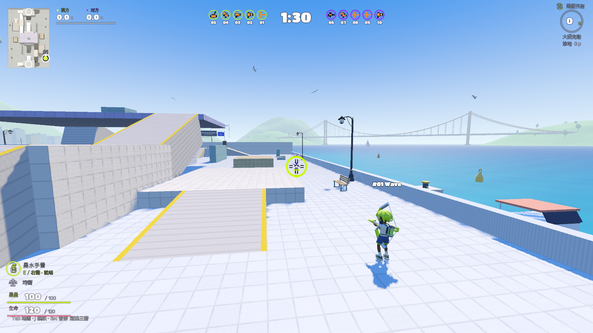
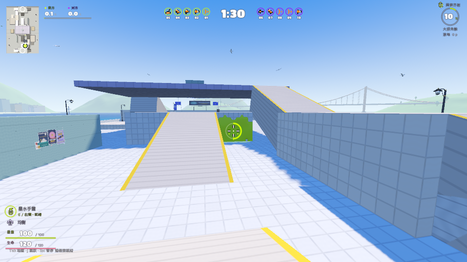
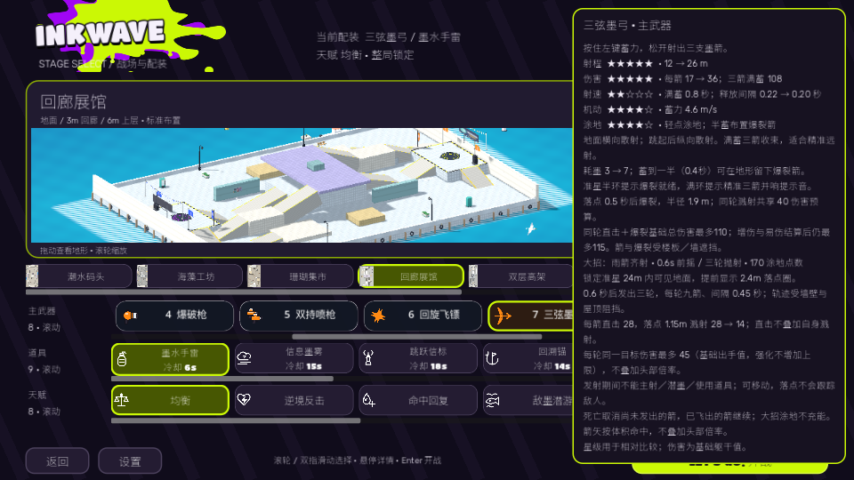

# 弓的三档节奏与真实远射 · 2026-10-03

## 定位 → 原因 → 修复

- 位置：`tidewater_bow.gd` 三箭散布、`equipment_catalog.gd` 蓄力与耗墨，`tidewater_combat.gd` 释放与提示，`tidewater_bot.gd` 实际配装攻击路径。
- 旧版失败复现：[before](bow27-before.txt)。8m 满蓄命中99，但16／23m只有33；满蓄侧箭散布0.035弧度，离得越远越容易两支侧箭落空；爆裂要求80%蓄力、耗墨10与1秒蓄力缺少半蓄用途。
- 新版轻点快速涂地／近身快射，半蓄0.4秒地形布置爆裂，满蓄0.8秒收束精准三箭。射程12→26m，弹速34→58m/s，每箭17→36，满蓄三箭108；耗墨3→7，蓄力移动4.6m/s，释放间隔0.22→0.20秒。
- 半蓄起地形留箭，0.5秒延迟爆裂／1.9m半径／三枚对同目标溅射共享40。基础直击＋爆裂共享110预算；最终扣血预算115也由整轮共享，飞行中启用强化／目标易伤仍不能绕过。继续受真实墙／薄楼板／伞面、实际体积和吸墨反击阻挡，不叠加头部倍率。
- 保留地面横向、空中纵向扇形；满蓄最终散布0.008弧度。准星显示三箭收束、半蓄刻度；已有小提示显示快速箭／爆裂箭就绪／精准三箭，满蓄音效。机器人近身快射，墨量不足改用半蓄或轻点；同规则实际付墨、实际飞行命中。

## 验证

1. [106项完整回归，0失败](bow27-checks.txt)，包含所有素材导出检查、生产解析、上下层交战、雨箭齐射、吸墨反击、装备方向与旧规则。[最终生产解析](bow27-parse-final.txt)、`git diff --check`通过；完整回归后仅修改文档／源码试玩预选和截图工具相机。
2. [新增实际弹道检查](bow27-precision.txt)：8／16／23m静止躯干均108；攻击者强化＋目标敌墨潜游易伤，以及发射后才启用强化，均115／剩5HP。半蓄中箭26.5＋两支落墙延迟爆裂共66.5。0.4秒半蓄真实释放耗5墨，低墨不显示爆裂就绪，近身和低墨机器人均实际发射并付墨。[原弓上下四种高度、墙与薄楼板检查](bow27-bow.txt)通过。
3. 原生[Metal](bow27-native.txt)和[兼容渲染](bow27-native-gl.txt)：正常配装初始化、真实鼠标按下／松开，16m三箭实际108／耗7，半蓄实际展馆地形留3箭／耗5和爆裂到期；1440×900／960×540准星提示与可见新说明核验。图像是受控验证，关闭正常移动／比赛时钟；人物没有重做。首轮工具只切换Combat，HUD仍显示原武器，修正为正常pending_loadout后重新核验；小窗口说明需真实鼠标进入可见弓卡片后核验。一次附加Metal重截图未释放（0伤害／未花墨）；截图工具加入下一步输入前恢复受控场景暂停状态的防护，最终Metal与兼容渲染均重跑通过，生产失焦暂停规则未改。

## 四局自然90秒样本

[实际场景日志](bow27-matches.txt)、[逐角色记录与生产哈希](bow27-matches.json)。两张地图各两个种子，正常输入驱动本地弓、九个混合武器机器人，均衡／手雷固定，机器人不重摇；30Hz无渲染正常身体物理、自然死亡／复活／计时，均90秒结算，个人与团队涂地账本一致。记录后逐项生产SHA256核验无变化。

“爆裂蓄力轮”包括满蓄，表示可爆裂的蓄力级别，并非爆裂命中数；发射统计只记正常释放后仍可观测的实际玩家箭，属于保守计数。

| 地图 / 种子 | 本地实际发射 / 满蓄 / 爆裂蓄力轮 | 本地低于5墨时间 | 弓机器人击倒 / 阵亡 | 弓机器人有效伤害 |
| --- | --- | --- | --- | --- |
| coral_market / 701 | 64 / 22 / 25 | 30.10 s | 10 / 5 | 1039.05 |
| coral_market / 1709 | 71 / 32 / 39 | 11.70 s | 12 / 5 | 1065.65 |
| viaduct / 701 | 53 / 15 / 19 | 35.43 s | 7 / 4 | 1248.20 |
| viaduct / 1709 | 59 / 15 / 19 | 47.83 s | 2 / 2 | 411.23 |

本地自动驱动按导航路线瞄地涂墨，四局本地玩家均没有战斗命中；机器人样本每局只有一名弓，混合武器、队伍与路径、专属大招都能影响结果。这些记录只确认资源／实际攻击／自然结算和账本，不是平衡因果对照或真人手感验收。无渲染样本不能说明帧率／发热；退出仍有ObjectDB警告，日志没有脚本错误，未把退出警告作为已修复项。

公开应用仍preview.15；本批为当前源码，未提交／导出／发布。`tools/preview_creative.gd`预选弓／手雷／均衡／双层高架，Enter开战。
