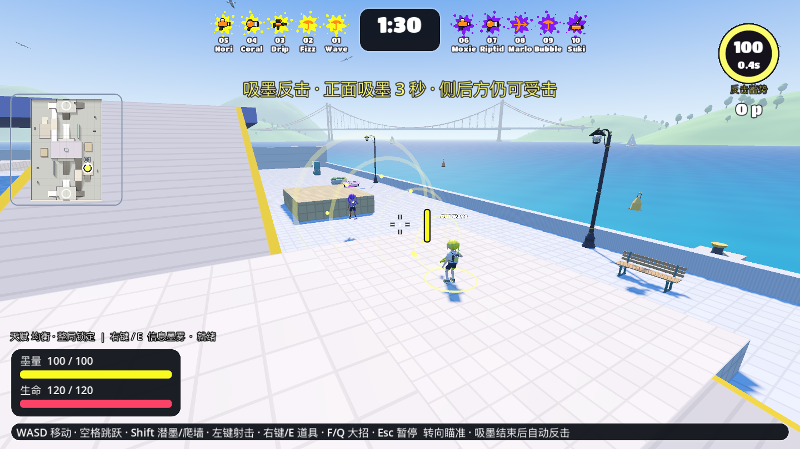
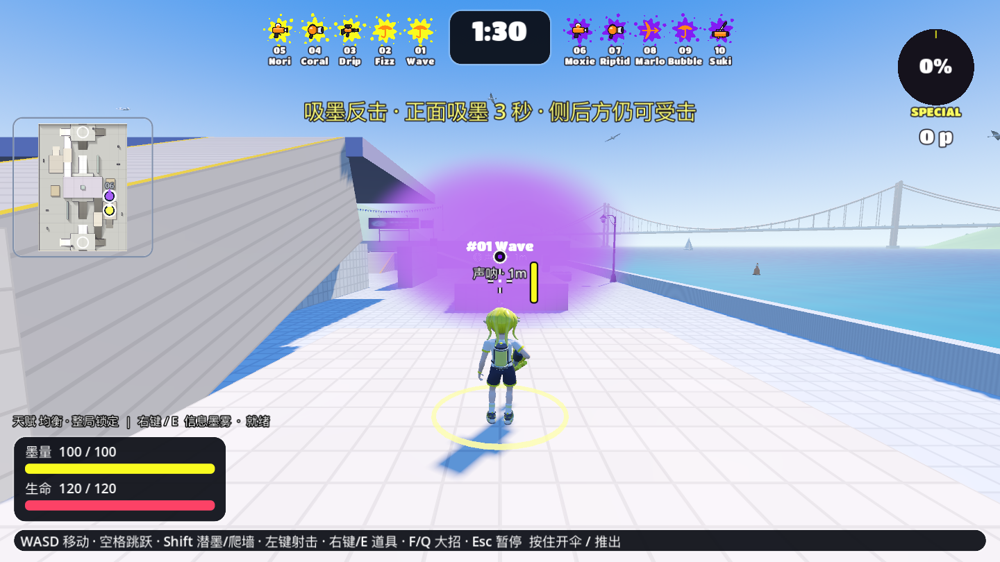
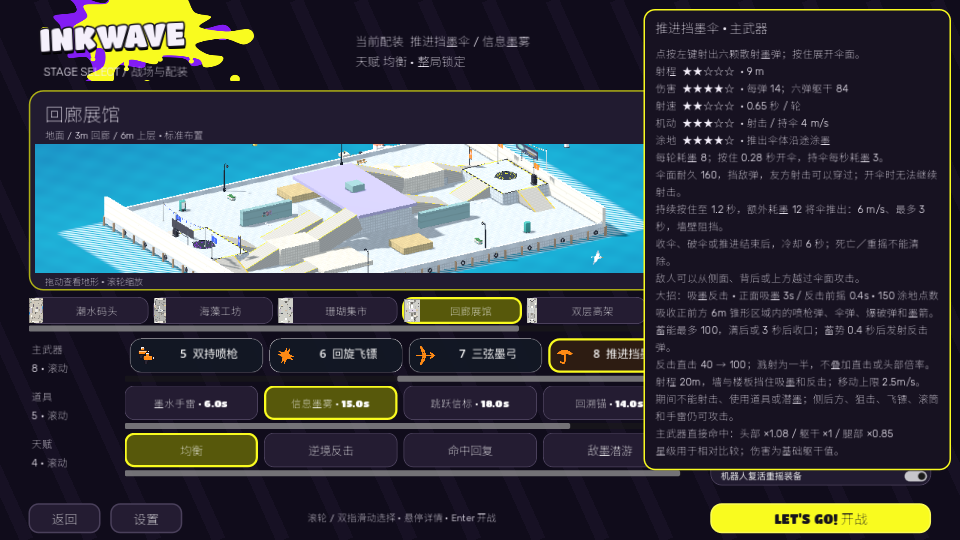

# 吸墨反击与信息墨雾 · 第四批 · 2026-10-02

当前源码功能；未提交、导出或发布。公开应用仍为 preview.15，人物实验与历史证据保留。

## 完成

- 伞配吸墨反击：150 涂地点数；6m 定向吸收飞行喷枪／伞／爆破弹与墨箭，3 秒或蓄能 100 后收口。0.4 秒暴露前摇后打一发 20m 反击弹，直击 40→100，溅射一半，不叠加直击或部位倍率。侧后方、狙击、飞镖、滚筒、手雷和已发生爆炸仍有效。按最早地图／人体碰撞截断线段，再检查吸取位置与嘴口的三维地图视线，墙和薄楼板不穿透。
- 移动限速 2.5m/s，锁主射／道具／潜墨；实际空中最低速度原本会绕过武器限速，新增仅在能力期间生效的水平限速，取消后恢复，垂直跳跃／重力继续。死亡取消待发反击，结束清理吸墨体。
- 信息墨雾替代可选减速墨雾：35 墨水／15 秒 CD／6 秒，8m 内可见落点、3m 半径、最多 4m 高、顶棚限制。敌方视线、血条、地图观察与开火闪光被遮断，己方可透视己雾；声呐临时标记反制，但实体遮挡继续。子弹可穿雾，不减速／伤害／涂地，部署者死亡后持续，每人最多一团，CD 跨死亡／换装保存。旧减速雾保留兼容规则。
- 机器人主射和所有大招共用感知，不再仅检查墙体。墨雾用获取的当前／最后接触部署，不读取未知敌人变换；反击共用玩家吸取与发射，能力期间继续真实身体移动和限速。
- 墨雾是深度裁剪的局部椭球视觉近似，有软边和流动密度，己雾淡、敌雾浓。雾中声呐标签另投影到 HUD，避免透明层压暗。吸墨蓄能／剩余时间显示在现有大招圆表，己方墨雾范围／剩余时间显示在大小地图，正常与 960×540 配装详情完整。

## 规则与画面

- [完整验证入口](creative19-checks-final.txt)：解析门禁先行、资源一致性和所有规则检查，95 通过、0 失败。
- [反击针对性检查](creative19-counter-final.txt)：真实线段进入锥体，友弹／出射方向不吸；侧后方、狙击和现成爆炸仍伤害；地图／薄楼板阻挡；三箭真实蓄能、满值收口、暴露期、单次反击与伤害来源；主射／道具／潜墨／空中惯性限制；超时、死亡、回合清理，机器人实际发动、移动、反击。额外以真实伞弹涂未占地面，46–47 轮受控发射填满 150 点，通过真实 F 键发动。此项控制位置与墨量，不是自然对战效率测量。
- [墨雾针对性检查](creative19-mist-ceiling.txt)：真实落位／消耗／CD／低顶棚、生命周期、被冻结的队伍接触、血条与地图一致性、己雾视线、射击闪光、声呐反制／实体遮挡、实际盲射命中、三维穿越／擦边及机器人基于情报使用。
- [兼容模式核验](creative19-gl.txt)：同台 Apple M5／arm64 的 OpenGL 4.1 Metal，墨雾深度重建分支编译／显示，浮层、受控新能力和截图通过；不是新的架构构建。
- [Metal 原生核验](creative19-native-final.txt)：默认 Forward+／Apple M5，真实详情浮层与小窗口、吸墨／满蓄／前摇／反击弹、敌雾／己雾／雾内／声呐／过期截图。画面是受控布置和状态，反击截图预设充能，不能当自然发动频率证据。

## 自然原生对战

[150 点配置原始记录](creative19-full-matches.json)、[原生日志](creative19-full-matches.txt)，真实移动／鼠标／左键／E／F 输入，90 秒计时、自然受击与死亡、出场／结算／Enter 返回主菜单。没有强制伤害、计时或阶段切换；复活重摇可能改变机器人武器和道具。两局都初选伞／信息墨雾／均衡。

| 地图 | 模式 | 时长 | 玩家自然死亡 | 全场墨雾投放 | 全场反击发动 | 平均 FPS | P99 | 结算／回主菜单 |
| --- | --- | --- | --- | --- | --- | --- | --- | --- |
| prism_gallery | 1v1 | 90s | 0 | 4 | 0 | 29.97 | 36.78 ms | 是／是 |
| terrace_garden | 5v5 | 90s | 3 | 8 | 0 | 29.93 | 39.78 ms | 是／是 |

两局均未自然触发吸墨反击：玩家累计涂地约 125.8／111.5 m²，死亡还会扣减充能，因此自然记录仅验证流程与实际墨雾使用，反击机制由受控规则／原生场景覆盖。最初 180 点两局同样未触发，已降到 150；[初版数据](creative19-full-matches-180cost.json)保留，不凭这些自动路线样本宣布充能频率或平衡已验收。最后的空中吸墨限速修正在自然回放后完成，追加实际移动规则与全回归、原生受控核验；没有把此前未发动的回放算作该限制的自然验证。

30 FPS／75% 精度／1280×720，与后台规则检查并行，帧率为本机该次回放记录，不是独占 GPU 基准。真人手感、多局平衡和长期温度尚未验收。

## 定位与保留

初次受控测试中的友弹在生成处命中了敌人、把玩家受击账本误当作全体账本，以及未锁指针导致从窗口角取射线，均修正测试布置。低顶棚暴露了真实落位问题：地面查询起点抬高 2m 会先命中上层，改为目标上方 0.2m，实际低顶棚部署与封顶通过。原生浮层捕获等待选择带／焦点稳定并保留失败日志；截图确实显示 150 点和正文，不以瞬间调用当作已显示。

头部／衣服未改。无界面快速连发可能出现 Godot ObjectDB 音频清理警告；完整原生画面不出现该泄漏诊断。macOS IMKCFRunLoopWakeUpReliable 输入法提示在部分原生进程中出现，未伴随 GDScript／着色器错误。失败首轮、180 点对照和最终日志都保留。

运行当前源码：仓库根目录 `./godot-port-prototype/run.sh`；`tools/preview_creative.gd` 预选伞／信息墨雾／敌墨潜游。后续为雨箭、墨翼、地雷、诱饵、补给盒与行为天赋。
