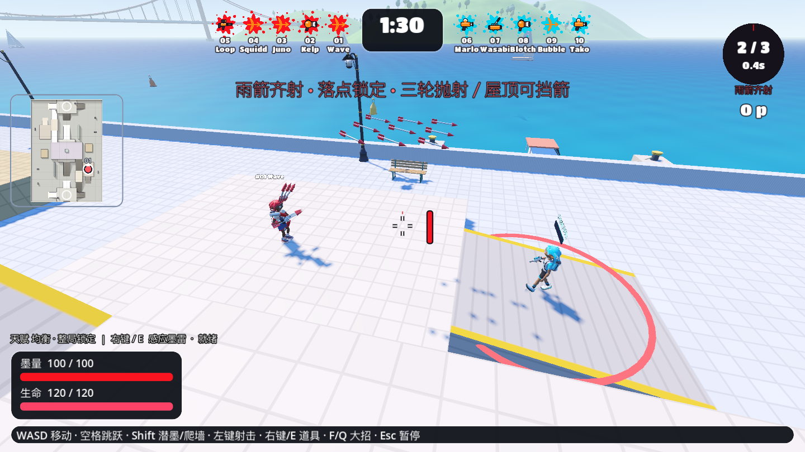
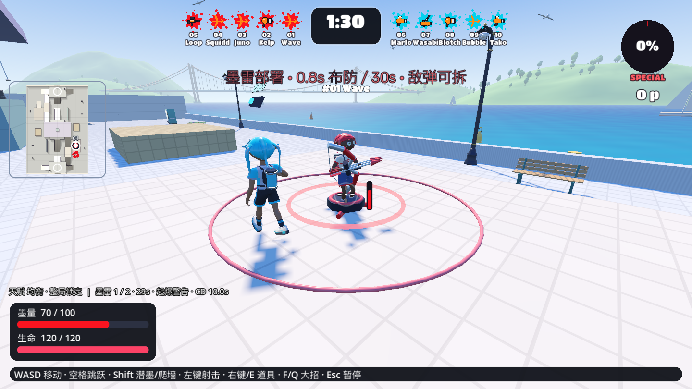
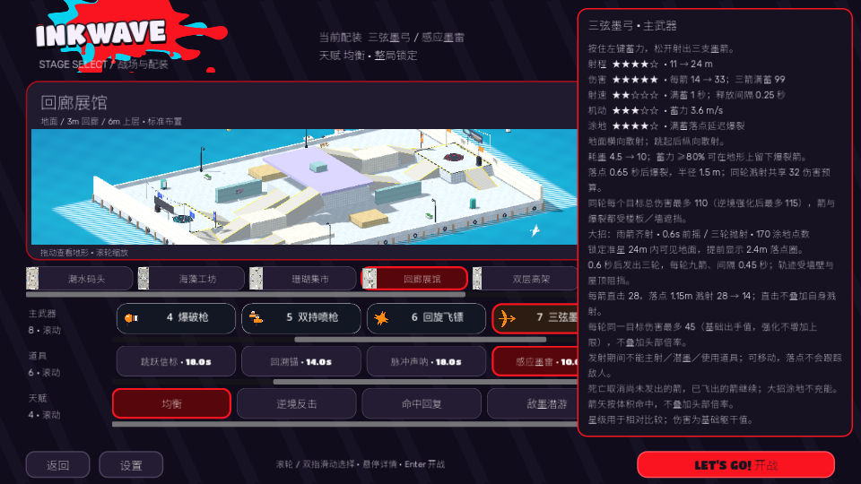

# 创意配装第五批：雨箭齐射与感应墨雷 · 2026-10-02

## 当前交付

- 三弦墨弓改配专属雨箭齐射，170 涂地点数。F / Q 锁定 24m 内可见地面，0.6s 前摇后发射三轮九箭，轮间 .45s。每箭从实际弓口抛出，恒定重力 24、完整三维扫掠，先比较地形与身体的最近碰撞，再处理吸墨反击；屋顶／楼板能挡箭。落点圈半径 2.4m，末轮发射后再保留 2s。每箭直接 28，1.15m 溅射 28→14，直击不叠加同箭溅射；每轮同目标强化后的出手伤害最多 45，目标承伤天赋仍生效。期间可移动，锁主射／潜墨／道具；死亡取消未发箭，已发箭继续；大招涂地计入实际贡献但不充自己的大招。
- 感应墨雷新增可选位，目录 8 武器／6 道具／4 天赋。30 墨水、25 HP、CD 10s、存活 30s，脚下真实落位 .8s 布防；每人两枚，第三枚替换最早一枚，同点拒绝叠放。2.2m 三维传感（能感应潜墨），.45s 起爆警告，3m 爆炸 50→25、标记受影响敌人 2s；墙／楼板挡触发、伤害、标记。敌弹／爆炸可安全拆除，警告期间仍可拆，死亡后保留、无友伤。友弹穿过己方装置层。
- 机器人沿同一可见性、落位、墨量、充能和伤害使用；雨箭施放保持真实身体移动与重力；受伤且已有接触时埋雷。只对队伍看得到的敌雷／雨箭落点选择撤离路线。大小地图显示己雷，HUD 显示布防数／警告及雨箭发射轮次；正常／小窗口详情同步。战斗正文使用随包 Noto Sans SC 回退，修复新增“敌弹可拆”提示缺字。

## 验证

| 项目 | 结果与证据 |
| --- | --- |
| 生产脚本解析与全量回归 | [最终完整日志](creative20-checks-credit-final.txt)：97 通过、0 失败。解析预检使用 GDScript.reload() != OK，并先于依赖检查。 |
| 墨雷规则 | [单项通过](creative20-mines-second.txt)；包括真实地面／墨量／CD、布防／警告／逃离、潜墨标记／到期、墙／薄楼板／高度、真实敌方狙击拆除、警告期爆破拆除、第三枚替换、死亡／重摇和机器人情报。 |
| 雨箭规则 | [最终额外规则](creative20-rain-credit.txt)；实际 F、天空拒绝保留原有蓄力、玩家／机器人真实击倒喷墨只计贡献而不充能、三轮真实弹道／伤害、45 预算与中途触发强化、屋顶／墙／薄楼板、死亡后已发箭归属、AI 对玩家实际伤害及施放期间重力。另以 32 轮真实主弓箭／爆裂箭在新墨面充满 170 点，再按 F 发动；位置／墨量受控，这不是自然计时对局。 |
| 原生 Metal / Forward+ | [最终日志](creative20-native-credit-final.txt)，Apple M5；1440×810 与 960×540 实际截图。真实 F / E，九箭首轮、弧线、命中、布防／起爆／队伍标记，以及中文 HUD 字符验证通过。 |
| 同机兼容渲染 | [GL 日志](creative20-gl-credit-final.txt)，OpenGL 4.1 Metal / Compatibility / Apple M5，同样通过；没有 x86／Rosetta 导出或运行。 |
| 两局自然 90 秒 | [JSON](creative20-full-matches.json)、[日志](creative20-full-matches.txt)，真实输入／自然计时、伤害、死亡、复活、结算／Enter 返回。没有为样本注入充能、缩短计时或强制击倒。 |

## 自然样本与边界

| 地图／人数 | 平均 FPS／P99 帧时间 | 玩家阵亡 | 全场雨箭／轮次 | 墨雷投放／触发／爆炸 | 结算／返回 |
| --- | --- | --- | --- | --- | --- |
| 回廊展馆 1v1，弓／均衡／墨雷 | 29.959／36.882ms | 2 | 0／0 | 3／1／1，均为玩家布置 | 通过／通过 |
| 阶梯花园 5v5，弓／敌墨潜游／墨雷 | 29.975／38.324ms | 2 | 1／3，机器人发动 | 4／0／0，其中玩家布置 2 枚 | 通过／通过 |

玩家自然涂地分别约 87.42／83.36m²，均未自然发动雨箭；所以样本只证明自然流程、一次 AI 发动及墨雷存在／触发，不能宣布 170 点的充能频率、伤害或真人手感平衡。1v1 机器人到 6.012m，花园本样本机器人最高约 4.767m。30 FPS 上限／75% 精度下录制，完整无界面回归同时进行，数据不是独立 GPU 性能／长期温度基准。

自然对局启动于末次提示字体、无效目标保留原蓄力及直接命中部位描述和击倒喷墨充能边界修正之前；弹道、装置、伤害数值和身体移动相同，末次调整另有完整回归／规则／原生检查。兼容模式为同一 arm64 机器上的备用渲染。

原生图为受控位置／资源场景；两局自动输入也不等于人工验收。地图圈是局部水平提示，陡坡上的圈与地形贴合仍是视觉近似。公开应用仍为 preview.15，本批只修改源码，未提交／导出／发布。

## 失败定位与退出警告

- 首轮新测试用 Node3D 动态属性推断局部变量类型失败，改为明确 int；解析失败和第二轮日志保留。
- 墨雷真实狙击测试最初把 _fire_charger_ray 的参数顺序写错，修正为武器、蓄力、枪口、方向；关闭已确认卡住的测试进程后重跑，未改生产伤害规则。
- 薄楼板雨箭测试最初从楼下锁定楼上不可见地面，后又让目标胶囊穿出楼板。修正为合法楼上出手位置及完全在板下的角色；真实薄板阻挡通过。
- 最终核对发现雨箭击倒后通用喷墨路径可能补充下一次大招：Combat._paint_team 原先没有检查 game.charge_special，而雨箭伤害也没有保护击倒喷墨。现在涂墨入口尊重统一标志，雨箭伤害同步关闭充能；新增玩家／机器人真实击倒、实际喷墨贡献增加、点数保持零的验证，完整回归重跑。
- 首轮完整回归 96 通过、1 失败，菜单仍写“五种道具”，改为六种；最终 97 通过。原生首次提示出现中文方框，统一随包字体后追加字符检查与重新截图。
- 无界面密集模拟雨箭在退出时有 AudioStreamWAV／AudioStreamPlaybackWAV 的 ObjectDB 警告；[verbose 定位](creative20-rain-physical-final.txt)列出 20 个实例，此前追加真实充能短测退出时为 26；最终带双方击倒喷墨验证的充能检查没有这个退出警告。未发现装置／箭矢／角色节点遗留；这是当前开发引擎无界面音频退出边界，不能据此宣称音频资源泄漏已修复。原生两局与受控截图没有相同警告。
- 沙箱日志的系统 CA ret != noErr 和原生 macOS IMKCFRunLoopWakeUpReliable 提示保留；规则日志中的其他 Script／Parse 错误不被过滤。

下一批仍保留墨翼／诱饵／补给盒与有代价的行为天赋；本批到此，先增加雨箭充能与墨雷反制的真人／多局样本。
